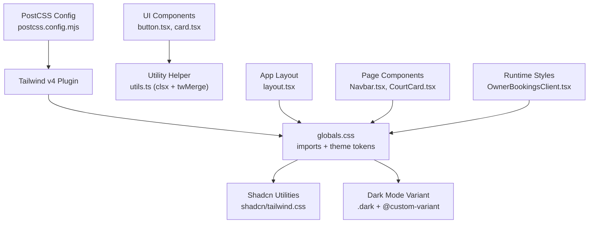
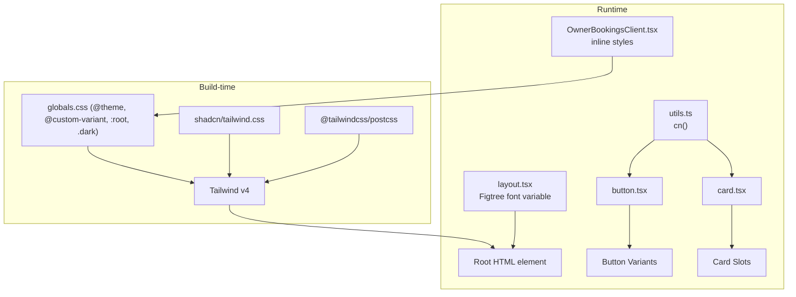
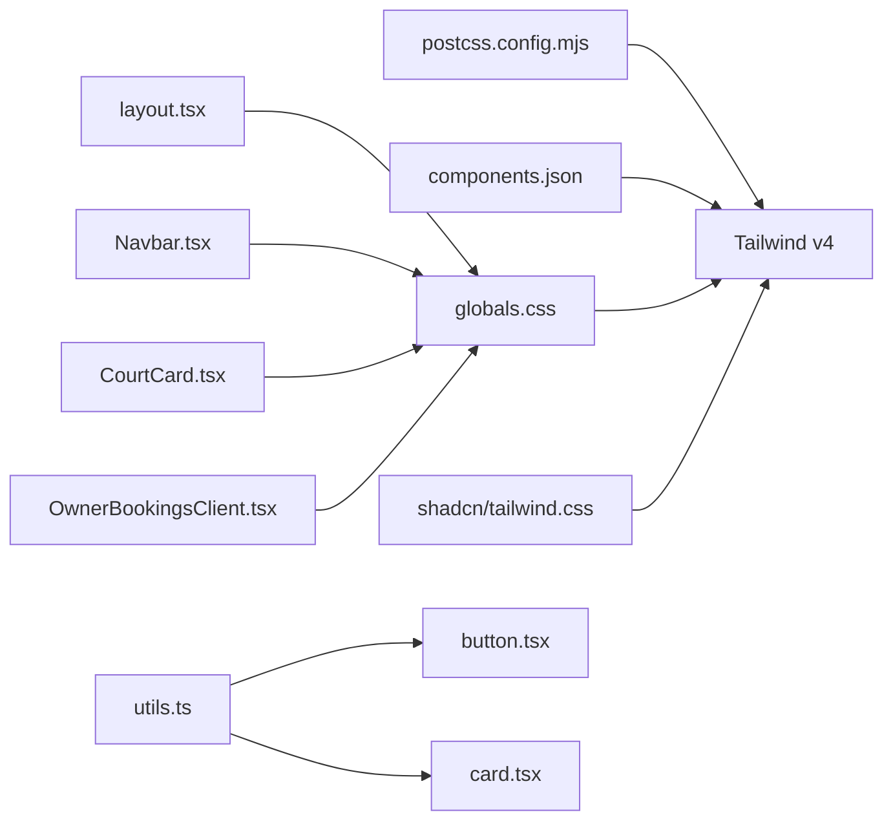

# Styling & Theming

<cite>
**Referenced Files in This Document**
- [globals.css](file://frontend/src/app/globals.css)
- [components.json](file://frontend/components.json)
- [postcss.config.mjs](file://frontend/postcss.config.mjs)
- [next.config.ts](file://frontend/next.config.ts)
- [package.json](file://frontend/package.json)
- [utils.ts](file://frontend/src/lib/utils.ts)
- [button.tsx](file://frontend/src/components/ui/button.tsx)
- [card.tsx](file://frontend/src/components/ui/card.tsx)
- [layout.tsx](file://frontend/src/app/layout.tsx)
- [Navbar.tsx](file://frontend/src/components/layouts/Navbar.tsx)
- [CourtCard.tsx](file://frontend/src/components/shared/CourtCard.tsx)
- [OwnerBookingsClient.tsx](file://frontend/src/components/owner/OwnerBookingsClient.tsx)
- [shadcn tailwind.css](file://frontend/node_modules/shadcn/dist/tailwind.css)
</cite>

## Table of Contents
1. [Introduction](#introduction)
2. [Project Structure](#project-structure)
3. [Core Components](#core-components)
4. [Architecture Overview](#architecture-overview)
5. [Detailed Component Analysis](#detailed-component-analysis)
6. [Dependency Analysis](#dependency-analysis)
7. [Performance Considerations](#performance-considerations)
8. [Troubleshooting Guide](#troubleshooting-guide)
9. [Conclusion](#conclusion)
10. [Appendices](#appendices)

## Introduction
This document explains the styling strategy and theming implementation for the project. It covers the Tailwind CSS configuration, design system setup via shadcn, and the utility-first approach. It documents the color palette, typography system, spacing scale, and component styling patterns. It also addresses responsive design principles, dark mode implementation, theme customization, CSS-in-JS patterns, animation strategies, performance optimization, and accessibility considerations.

## Project Structure
The styling pipeline is built around:
- Tailwind v4 configured via PostCSS
- A centralized design token system using CSS variables
- A shadcn-inspired design system with custom variants and utilities
- Utility-first components leveraging class-variance-authority and clsx/tailwind-merge
- Dark mode driven by a custom dark variant and CSS variables

**Diagram sources**
- [postcss.config.mjs:1-8](file://frontend/postcss.config.mjs#L1-L8)
- [globals.css:1-130](file://frontend/src/app/globals.css#L1-L130)
- [shadcn tailwind.css:1-96](file://frontend/node_modules/shadcn/dist/tailwind.css#L1-L96)
- [button.tsx:1-68](file://frontend/src/components/ui/button.tsx#L1-L68)
- [card.tsx:1-104](file://frontend/src/components/ui/card.tsx#L1-L104)
- [utils.ts:1-7](file://frontend/src/lib/utils.ts#L1-L7)
- [layout.tsx:1-50](file://frontend/src/app/layout.tsx#L1-L50)
- [Navbar.tsx:1-119](file://frontend/src/components/layouts/Navbar.tsx#L1-L119)
- [CourtCard.tsx:1-73](file://frontend/src/components/shared/CourtCard.tsx#L1-L73)
- [OwnerBookingsClient.tsx:285-322](file://frontend/src/components/owner/OwnerBookingsClient.tsx#L285-L322)

**Section sources**
- [postcss.config.mjs:1-8](file://frontend/postcss.config.mjs#L1-L8)
- [components.json:1-26](file://frontend/components.json#L1-L26)
- [globals.css:1-130](file://frontend/src/app/globals.css#L1-L130)
- [layout.tsx:1-50](file://frontend/src/app/layout.tsx#L1-L50)

## Core Components
- Design tokens and theme: Centralized in CSS variables with oklch color definitions and radius scales.
- Dark mode: Implemented via a custom dark variant and a dedicated selector that switches variables for dark conditions.
- Typography: Figtree is loaded and bound to a CSS variable for the font stack.
- Base layer: Tailwind base layer applies global resets and sets defaults for borders, outlines, backgrounds, and text colors.
- Component primitives: Button and Card components use class variance authority to define variants and sizes, merged with clsx and twMerge.

Key implementation references:
- Theme tokens and dark mode: [globals.css:7-130](file://frontend/src/app/globals.css#L7-L130)
- Typography binding: [layout.tsx:3-6](file://frontend/src/app/layout.tsx#L3-L6)
- Button variants and sizes: [button.tsx:7-42](file://frontend/src/components/ui/button.tsx#L7-L42)
- Card composition and slots: [card.tsx:5-103](file://frontend/src/components/ui/card.tsx#L5-L103)
- Utility merging: [utils.ts:4-6](file://frontend/src/lib/utils.ts#L4-L6)

**Section sources**
- [globals.css:7-130](file://frontend/src/app/globals.css#L7-L130)
- [layout.tsx:3-6](file://frontend/src/app/layout.tsx#L3-L6)
- [button.tsx:7-42](file://frontend/src/components/ui/button.tsx#L7-L42)
- [card.tsx:5-103](file://frontend/src/components/ui/card.tsx#L5-L103)
- [utils.ts:4-6](file://frontend/src/lib/utils.ts#L4-L6)

## Architecture Overview
The styling architecture combines:
- Tailwind v4 plugin via PostCSS
- Shadcn utilities and custom variants
- CSS variables for theme tokens
- Utility-first components with variant composition
- Runtime CSS injection for specialized layouts

**Diagram sources**
- [postcss.config.mjs:1-8](file://frontend/postcss.config.mjs#L1-L8)
- [globals.css:1-130](file://frontend/src/app/globals.css#L1-L130)
- [shadcn tailwind.css:1-96](file://frontend/node_modules/shadcn/dist/tailwind.css#L1-L96)
- [layout.tsx:34-46](file://frontend/src/app/layout.tsx#L34-L46)
- [utils.ts:4-6](file://frontend/src/lib/utils.ts#L4-L6)
- [button.tsx:54-64](file://frontend/src/components/ui/button.tsx#L54-L64)
- [card.tsx:10-21](file://frontend/src/components/ui/card.tsx#L10-L21)
- [OwnerBookingsClient.tsx:285-322](file://frontend/src/components/owner/OwnerBookingsClient.tsx#L285-L322)

## Detailed Component Analysis

### Color Palette and Theme Tokens
- Color system: Uses oklch color definitions for background, foreground, primary, secondary, muted, accent, destructive, border, input, ring, popover, card, and sidebar tokens.
- Dark mode: A dedicated selector switches variables for dark conditions, ensuring contrast and readability.
- Chart colors: Multiple chart tokens are defined for data visualization.
- Radius scale: A base radius token with derived sizes for small to extra-large radii.

Implementation references:
- Theme tokens and variables: [globals.css:7-49](file://frontend/src/app/globals.css#L7-L49)
- Light theme variables: [globals.css:51-84](file://frontend/src/app/globals.css#L51-L84)
- Dark theme variables: [globals.css:86-118](file://frontend/src/app/globals.css#L86-L118)

**Section sources**
- [globals.css:7-118](file://frontend/src/app/globals.css#L7-L118)

### Typography System
- Font binding: The Figtree font is loaded and assigned to a CSS variable for the font stack.
- Headings and mono fonts: Additional variables are defined for headings and monospace fonts.
- Base layer: The base layer applies the font-sans class to the html element.

Implementation references:
- Font variable binding: [layout.tsx:3-6](file://frontend/src/app/layout.tsx#L3-L6)
- Base layer font assignment: [globals.css:127-129](file://frontend/src/app/globals.css#L127-L129)

**Section sources**
- [layout.tsx:3-6](file://frontend/src/app/layout.tsx#L3-L6)
- [globals.css:127-129](file://frontend/src/app/globals.css#L127-L129)

### Spacing Scale and Radius Scale
- Spacing: Derived from the base radius token with predefined multipliers for small, medium, large, extra-large, and extra-extra-large radii.
- Consistent sizing: Components use data attributes and CSS selectors to adapt spacing and sizing consistently.

Implementation references:
- Radius tokens: [globals.css:42-49](file://frontend/src/app/globals.css#L42-L49)
- Component sizing with data attributes: [button.tsx:23-35](file://frontend/src/components/ui/button.tsx#L23-L35)

**Section sources**
- [globals.css:42-49](file://frontend/src/app/globals.css#L42-L49)
- [button.tsx:23-35](file://frontend/src/components/ui/button.tsx#L23-L35)

### Component Styling Patterns
- Button component: Uses class-variance-authority to define variants (default, outline, secondary, ghost, destructive, link) and sizes (default, xs, sm, lg, icon, icon-xs, icon-sm, icon-lg). Merged with cn() for safe class concatenation.
- Card component: Composed of multiple slots (header, title, description, action, content, footer) with responsive and adaptive behavior controlled by data attributes.

Implementation references:
- Button variants and sizes: [button.tsx:7-42](file://frontend/src/components/ui/button.tsx#L7-L42)
- Button rendering and data attributes: [button.tsx:44-65](file://frontend/src/components/ui/button.tsx#L44-L65)
- Card slots and sizes: [card.tsx:5-103](file://frontend/src/components/ui/card.tsx#L5-L103)

**Section sources**
- [button.tsx:7-65](file://frontend/src/components/ui/button.tsx#L7-L65)
- [card.tsx:5-103](file://frontend/src/components/ui/card.tsx#L5-L103)

### Responsive Design Principles
- Utility-first breakpoints: Components apply responsive utilities directly on elements.
- Adaptive layouts: Cards and buttons adjust padding, gap, and typography at smaller sizes using data attributes and CSS selectors.
- Image responsiveness: Images use sizes and aspect ratios to optimize loading and rendering.

Implementation references:
- Responsive button sizing: [button.tsx:23-35](file://frontend/src/components/ui/button.tsx#L23-L35)
- Card size adaptation: [card.tsx:10-21](file://frontend/src/components/ui/card.tsx#L10-L21)
- Image sizing and aspect ratio: [CourtCard.tsx:27-40](file://frontend/src/components/shared/CourtCard.tsx#L27-L40)

**Section sources**
- [button.tsx:23-35](file://frontend/src/components/ui/button.tsx#L23-L35)
- [card.tsx:10-21](file://frontend/src/components/ui/card.tsx#L10-L21)
- [CourtCard.tsx:27-40](file://frontend/src/components/shared/CourtCard.tsx#L27-L40)

### Dark Mode Implementation
- Custom dark variant: A custom variant targets elements under the .dark class.
- Variable switching: The .dark selector redefines all theme variables for dark conditions.
- Component integration: Components inherit dark mode styles automatically when placed under the dark class.

Implementation references:
- Dark variant definition: [globals.css:5](file://frontend/src/app/globals.css#L5)
- Dark selector and variable overrides: [globals.css:86-118](file://frontend/src/app/globals.css#L86-L118)
- Navbar dark styles: [Navbar.tsx:38](file://frontend/src/components/layouts/Navbar.tsx#L38)

**Section sources**
- [globals.css:5](file://frontend/src/app/globals.css#L5)
- [globals.css:86-118](file://frontend/src/app/globals.css#L86-L118)
- [Navbar.tsx:38](file://frontend/src/components/layouts/Navbar.tsx#L38)

### Theme Customization
- Token-driven customization: All colors and radii are defined via CSS variables, enabling easy theme swaps.
- Shadcn utilities: Custom variants and utilities extend Tailwind capabilities for component states and animations.
- Configuration: The design system is configured via components.json with Tailwind CSS variables enabled.

Implementation references:
- Theme variables mapping: [globals.css:7-49](file://frontend/src/app/globals.css#L7-L49)
- Shadcn custom variants and utilities: [shadcn tailwind.css:27-96](file://frontend/node_modules/shadcn/dist/tailwind.css#L27-L96)
- Design system configuration: [components.json:6-12](file://frontend/components.json#L6-L12)

**Section sources**
- [globals.css:7-49](file://frontend/src/app/globals.css#L7-L49)
- [shadcn tailwind.css:27-96](file://frontend/node_modules/shadcn/dist/tailwind.css#L27-L96)
- [components.json:6-12](file://frontend/components.json#L6-L12)

### CSS-in-JS Patterns and Inline Styles
- Inline runtime styles: Some components inject scoped styles dynamically for specialized layouts.
- Pattern: Define a style block with a unique class and apply targeted CSS for specific scenarios.

Implementation references:
- Inline timeline styles: [OwnerBookingsClient.tsx:285-319](file://frontend/src/components/owner/OwnerBookingsClient.tsx#L285-L319)

**Section sources**
- [OwnerBookingsClient.tsx:285-319](file://frontend/src/components/owner/OwnerBookingsClient.tsx#L285-L319)

### Animation Strategies
- Tailwind animations: tw-animate-css is imported to enable animation utilities.
- Component transitions: Buttons and cards use transition utilities for hover and focus states.

Implementation references:
- Animation import: [globals.css:2](file://frontend/src/app/globals.css#L2)
- Button transitions and focus rings: [button.tsx:8](file://frontend/src/components/ui/button.tsx#L8)
- Hover scaling on images: [CourtCard.tsx:38](file://frontend/src/components/shared/CourtCard.tsx#L38)

**Section sources**
- [globals.css:2](file://frontend/src/app/globals.css#L2)
- [button.tsx:8](file://frontend/src/components/ui/button.tsx#L8)
- [CourtCard.tsx:38](file://frontend/src/components/shared/CourtCard.tsx#L38)

## Dependency Analysis
The styling stack depends on:
- Tailwind v4 via PostCSS
- Shadcn utilities for custom variants and utilities
- CSS variables for theme tokens
- Utility helpers for class merging

**Diagram sources**
- [postcss.config.mjs:1-8](file://frontend/postcss.config.mjs#L1-L8)
- [components.json:1-26](file://frontend/components.json#L1-L26)
- [globals.css:1-130](file://frontend/src/app/globals.css#L1-L130)
- [shadcn tailwind.css:1-96](file://frontend/node_modules/shadcn/dist/tailwind.css#L1-L96)
- [utils.ts:4-6](file://frontend/src/lib/utils.ts#L4-L6)
- [button.tsx:54-64](file://frontend/src/components/ui/button.tsx#L54-L64)
- [card.tsx:10-21](file://frontend/src/components/ui/card.tsx#L10-L21)
- [layout.tsx:34-46](file://frontend/src/app/layout.tsx#L34-L46)
- [Navbar.tsx:38](file://frontend/src/components/layouts/Navbar.tsx#L38)
- [CourtCard.tsx:25-40](file://frontend/src/components/shared/CourtCard.tsx#L25-L40)
- [OwnerBookingsClient.tsx:285-319](file://frontend/src/components/owner/OwnerBookingsClient.tsx#L285-L319)

**Section sources**
- [postcss.config.mjs:1-8](file://frontend/postcss.config.mjs#L1-L8)
- [components.json:1-26](file://frontend/components.json#L1-L26)
- [globals.css:1-130](file://frontend/src/app/globals.css#L1-L130)
- [utils.ts:4-6](file://frontend/src/lib/utils.ts#L4-L6)
- [button.tsx:54-64](file://frontend/src/components/ui/button.tsx#L54-L64)
- [card.tsx:10-21](file://frontend/src/components/ui/card.tsx#L10-L21)
- [layout.tsx:34-46](file://frontend/src/app/layout.tsx#L34-L46)
- [Navbar.tsx:38](file://frontend/src/components/layouts/Navbar.tsx#L38)
- [CourtCard.tsx:25-40](file://frontend/src/components/shared/CourtCard.tsx#L25-L40)
- [OwnerBookingsClient.tsx:285-319](file://frontend/src/components/owner/OwnerBookingsClient.tsx#L285-L319)

## Performance Considerations
- CSS optimization: Tailwind v4 generates only the utilities used in the codebase, minimizing unused CSS.
- Critical CSS extraction: Place essential styles in globals.css and keep component-specific styles scoped to reduce render-blocking.
- Bundle size reduction: Prefer utility classes over custom CSS, leverage CSS variables for themes, and avoid large inline styles.
- Image optimization: Use appropriate sizes and aspect ratios to reduce bandwidth and improve rendering performance.
- React Compiler: Enabled in Next.js configuration to optimize component rendering.

Implementation references:
- Tailwind v4 plugin: [postcss.config.mjs:3](file://frontend/postcss.config.mjs#L3)
- React Compiler: [next.config.ts:5](file://frontend/next.config.ts#L5)
- Image optimization: [CourtCard.tsx:37-40](file://frontend/src/components/shared/CourtCard.tsx#L37-L40)

**Section sources**
- [postcss.config.mjs:3](file://frontend/postcss.config.mjs#L3)
- [next.config.ts:5](file://frontend/next.config.ts#L5)
- [CourtCard.tsx:37-40](file://frontend/src/components/shared/CourtCard.tsx#L37-L40)

## Troubleshooting Guide
- Dark mode not applying: Ensure the .dark class is present on the root element and that the dark selector overrides all theme variables.
- Typography not loading: Verify the font variable is applied to the html element and that the font is properly linked.
- Button or Card styles not updating: Confirm that cn() merges classes correctly and that variant props are passed as expected.
- Inline styles overriding theme: Keep inline styles scoped and avoid conflicting with global tokens.

Common references:
- Dark variant and selector: [globals.css:5](file://frontend/src/app/globals.css#L5), [globals.css:86-118](file://frontend/src/app/globals.css#L86-L118)
- Font variable application: [layout.tsx:34](file://frontend/src/app/layout.tsx#L34)
- Class merging: [utils.ts:4-6](file://frontend/src/lib/utils.ts#L4-L6)
- Button rendering: [button.tsx:54-64](file://frontend/src/components/ui/button.tsx#L54-L64)
- Card rendering: [card.tsx:10-21](file://frontend/src/components/ui/card.tsx#L10-L21)

**Section sources**
- [globals.css:5](file://frontend/src/app/globals.css#L5)
- [globals.css:86-118](file://frontend/src/app/globals.css#L86-L118)
- [layout.tsx:34](file://frontend/src/app/layout.tsx#L34)
- [utils.ts:4-6](file://frontend/src/lib/utils.ts#L4-L6)
- [button.tsx:54-64](file://frontend/src/components/ui/button.tsx#L54-L64)
- [card.tsx:10-21](file://frontend/src/components/ui/card.tsx#L10-L21)

## Conclusion
The project employs a robust, utility-first styling strategy powered by Tailwind v4 and a shadcn-inspired design system. CSS variables centralize theme tokens, while custom variants and utilities extend Tailwind’s capabilities. Components are composed with class-variance-authority and clsx/tailwind-merge, ensuring consistency and maintainability. Dark mode and responsive patterns are integrated seamlessly, and performance is optimized through minimal CSS generation and image best practices.

## Appendices
- Package dependencies related to styling and theming:
  - Tailwind CSS and PostCSS plugin
  - Shadcn utilities
  - class-variance-authority, clsx, tailwind-merge
  - tw-animate-css
- Configuration files:
  - components.json for design system settings
  - postcss.config.mjs for Tailwind plugin
  - next.config.ts for React Compiler

**Section sources**
- [package.json:11-38](file://frontend/package.json#L11-L38)
- [components.json:1-26](file://frontend/components.json#L1-L26)
- [postcss.config.mjs:1-8](file://frontend/postcss.config.mjs#L1-L8)
- [next.config.ts:5](file://frontend/next.config.ts#L5)