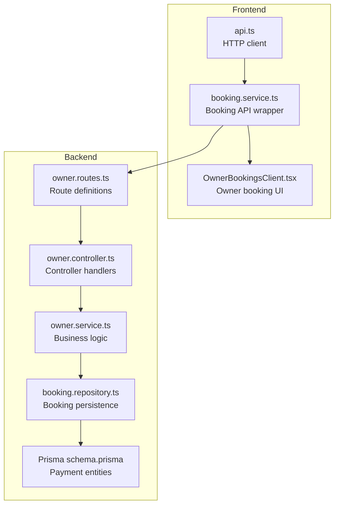
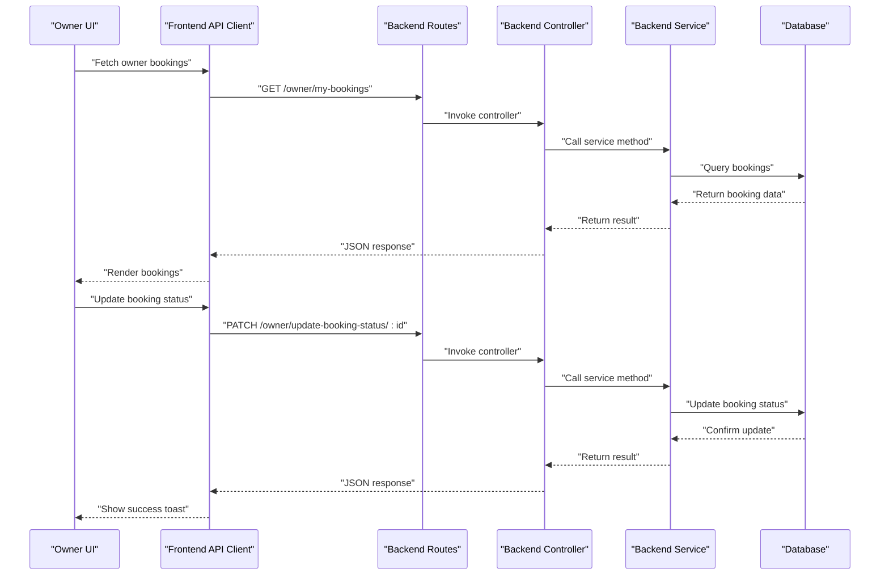
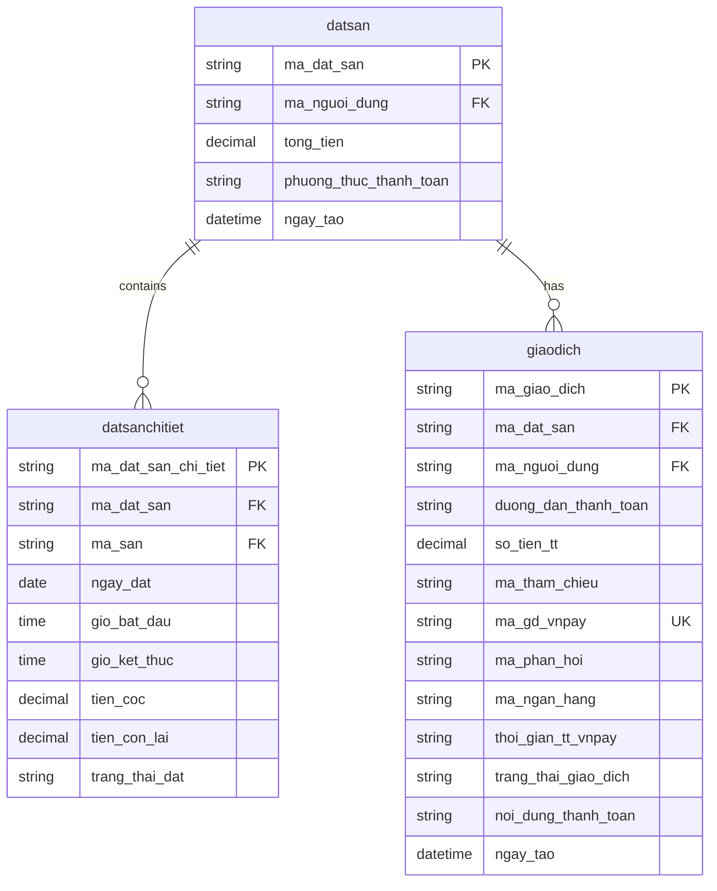
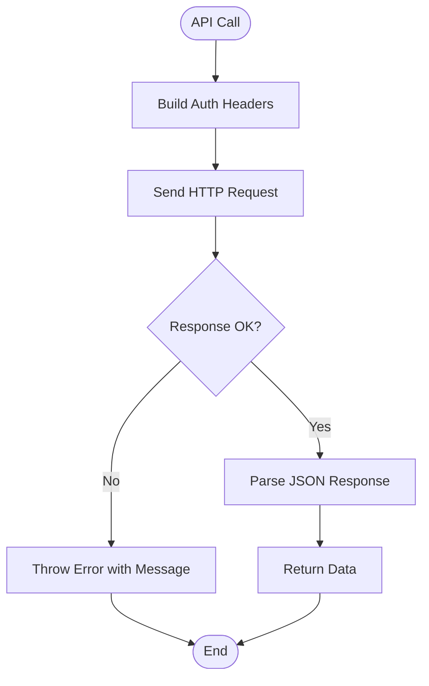
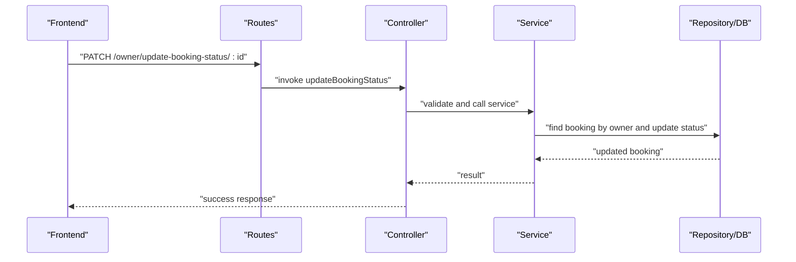
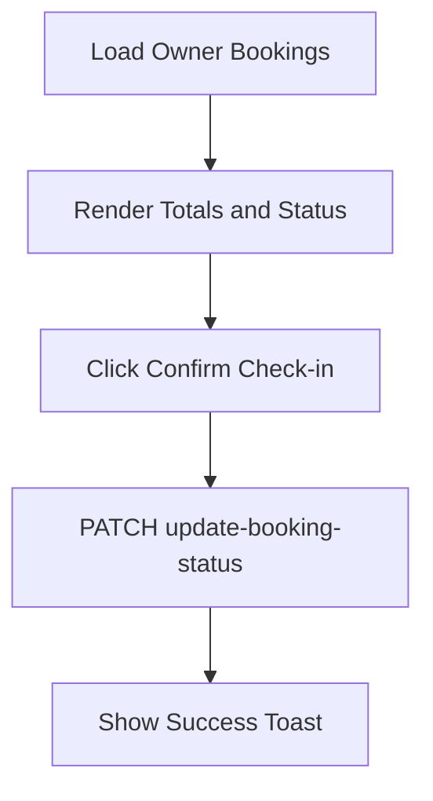
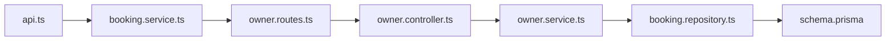

# Payment System Integration

<cite>
**Referenced Files in This Document**
- [schema.prisma](file://backend/prisma/schema.prisma)
- [booking.repository.ts](file://backend/src/repositories/booking.repository.ts)
- [booking.service.ts](file://frontend/src/services/booking.service.ts)
- [api.ts](file://frontend/src/services/api.ts)
- [owner.routes.ts](file://backend/src/routers/owner.routes.ts)
- [owner.controller.ts](file://backend/src/controllers/owner.controller.ts)
- [owner.service.ts](file://backend/src/services/owner.service.ts)
- [OwnerBookingsClient.tsx](file://frontend/src/components/owner/OwnerBookingsClient.tsx)
</cite>

## Table of Contents
1. [Introduction](#introduction)
2. [Project Structure](#project-structure)
3. [Core Components](#core-components)
4. [Architecture Overview](#architecture-overview)
5. [Detailed Component Analysis](#detailed-component-analysis)
6. [Dependency Analysis](#dependency-analysis)
7. [Performance Considerations](#performance-considerations)
8. [Troubleshooting Guide](#troubleshooting-guide)
9. [Conclusion](#conclusion)
10. [Appendices](#appendices)

## Introduction
This document describes the payment system integration for the sports facility booking platform. It focuses on VNPAY integration, transaction processing, and the end-to-end payment workflow. It also documents the checkout process, payment verification, transaction logging, refund handling procedures, payment form integration, security considerations for sensitive data, PCI compliance requirements, error handling strategies, payment status tracking, integration with the booking system, testing procedures for payment flows, and troubleshooting common payment processing issues.

Current implementation highlights:
- Database schema defines payment-related entities and fields for VNPAY transactions.
- Backend routes and controllers expose booking management endpoints used in the payment workflow.
- Frontend services and components support booking status updates and UI interactions.
- Payment form integration and VNPAY verification are not implemented in the current codebase and require extension.

## Project Structure
The payment system spans backend and frontend modules:
- Backend: Prisma schema defines payment entities, route handlers, controllers, services, and repositories.
- Frontend: Services and components integrate with backend APIs to manage booking and payment states.

**Diagram sources**
- [owner.routes.ts:1-23](file://backend/src/routers/owner.routes.ts#L1-L23)
- [owner.controller.ts:1-110](file://backend/src/controllers/owner.controller.ts#L1-L110)
- [owner.service.ts:1-148](file://backend/src/services/owner.service.ts#L1-L148)
- [booking.repository.ts:1-49](file://backend/src/repositories/booking.repository.ts#L1-L49)
- [schema.prisma:31-89](file://backend/prisma/schema.prisma#L31-L89)

**Section sources**
- [owner.routes.ts:1-23](file://backend/src/routers/owner.routes.ts#L1-L23)
- [owner.controller.ts:1-110](file://backend/src/controllers/owner.controller.ts#L1-L110)
- [owner.service.ts:1-148](file://backend/src/services/owner.service.ts#L1-L148)
- [booking.repository.ts:1-49](file://backend/src/repositories/booking.repository.ts#L1-L49)
- [schema.prisma:31-89](file://backend/prisma/schema.prisma#L31-L89)

## Core Components
- Payment entities in the database:
  - Booking header: stores total amount, payment method, and links to transaction records.
  - Booking detail: stores per-slot booking data and status.
  - Transaction: stores VNPAY-specific fields including reference, response code, bank code, time, and transaction status.
- Frontend services:
  - HTTP client handles base URL, auth headers, and response parsing.
  - Booking service wraps GET/patch endpoints for owner booking management.
- Backend routes and controllers:
  - Expose owner booking retrieval and status update endpoints.
  - Controllers delegate to services and return structured responses.
- Business logic:
  - Owner service orchestrates booking queries and status updates with permission checks.

Key implementation references:
- Payment entities and fields: [schema.prisma:31-89](file://backend/prisma/schema.prisma#L31-L89)
- Booking repository methods: [booking.repository.ts:1-49](file://backend/src/repositories/booking.repository.ts#L1-L49)
- Frontend API client: [api.ts:1-83](file://frontend/src/services/api.ts#L1-L83)
- Booking service: [booking.service.ts:1-13](file://frontend/src/services/booking.service.ts#L1-L13)
- Owner routes: [owner.routes.ts:1-23](file://backend/src/routers/owner.routes.ts#L1-L23)
- Owner controller: [owner.controller.ts:84-110](file://backend/src/controllers/owner.controller.ts#L84-L110)
- Owner service: [owner.service.ts:131-144](file://backend/src/services/owner.service.ts#L131-L144)

**Section sources**
- [schema.prisma:31-89](file://backend/prisma/schema.prisma#L31-L89)
- [booking.repository.ts:1-49](file://backend/src/repositories/booking.repository.ts#L1-L49)
- [api.ts:1-83](file://frontend/src/services/api.ts#L1-L83)
- [booking.service.ts:1-13](file://frontend/src/services/booking.service.ts#L1-L13)
- [owner.routes.ts:1-23](file://backend/src/routers/owner.routes.ts#L1-L23)
- [owner.controller.ts:84-110](file://backend/src/controllers/owner.controller.ts#L84-L110)
- [owner.service.ts:131-144](file://backend/src/services/owner.service.ts#L131-L144)

## Architecture Overview
The payment workflow integrates frontend UI, backend routes, controllers, services, repositories, and the database. The current codebase supports booking status updates and exposes endpoints used in payment flows. Payment form integration and VNPAY verification are not implemented and require extension.

**Diagram sources**
- [owner.routes.ts:19-20](file://backend/src/routers/owner.routes.ts#L19-L20)
- [owner.controller.ts:84-110](file://backend/src/controllers/owner.controller.ts#L84-L110)
- [owner.service.ts:131-144](file://backend/src/services/owner.service.ts#L131-L144)
- [booking.repository.ts:27-45](file://backend/src/repositories/booking.repository.ts#L27-L45)
- [api.ts:24-80](file://frontend/src/services/api.ts#L24-L80)
- [booking.service.ts:4-12](file://frontend/src/services/booking.service.ts#L4-L12)

## Detailed Component Analysis

### Database Schema and Payment Entities
The Prisma schema defines three core entities relevant to payments:
- Booking header (datsan): total amount, payment method, creation timestamp, relations to booking details and transactions.
- Booking detail (datsanchitiet): per-slot booking with date/time slots, deposit, remaining balance, and status.
- Transaction (giaodich): VNPAY transaction record with reference, response code, bank code, time, and transaction status.

**Diagram sources**
- [schema.prisma:31-89](file://backend/prisma/schema.prisma#L31-L89)

**Section sources**
- [schema.prisma:31-89](file://backend/prisma/schema.prisma#L31-L89)

### Frontend API Integration
The frontend API client provides a unified HTTP interface:
- Base URL resolution from environment variables.
- Authorization header injection for protected endpoints.
- Response parsing and error handling.

**Diagram sources**
- [api.ts:16-22](file://frontend/src/services/api.ts#L16-L22)
- [api.ts:24-80](file://frontend/src/services/api.ts#L24-L80)

**Section sources**
- [api.ts:1-83](file://frontend/src/services/api.ts#L1-L83)

### Booking Management Endpoints
Owner endpoints enable retrieving and updating booking statuses:
- GET /owner/my-bookings: Fetch owner’s bookings with related details and user info.
- PATCH /owner/update-booking-status/:id: Update booking status with validation.

**Diagram sources**
- [owner.routes.ts:19-20](file://backend/src/routers/owner.routes.ts#L19-L20)
- [owner.controller.ts:94-109](file://backend/src/controllers/owner.controller.ts#L94-L109)
- [owner.service.ts:135-144](file://backend/src/services/owner.service.ts#L135-L144)
- [booking.repository.ts:27-45](file://backend/src/repositories/booking.repository.ts#L27-L45)

**Section sources**
- [owner.routes.ts:1-23](file://backend/src/routers/owner.routes.ts#L1-L23)
- [owner.controller.ts:84-110](file://backend/src/controllers/owner.controller.ts#L84-L110)
- [owner.service.ts:131-144](file://backend/src/services/owner.service.ts#L131-L144)
- [booking.repository.ts:1-49](file://backend/src/repositories/booking.repository.ts#L1-L49)

### Owner Bookings UI Integration
The owner bookings client displays booking totals and allows confirming check-in, which triggers a status update.

**Diagram sources**
- [OwnerBookingsClient.tsx:256-283](file://frontend/src/components/owner/OwnerBookingsClient.tsx#L256-L283)
- [booking.service.ts:9-11](file://frontend/src/services/booking.service.ts#L9-L11)

**Section sources**
- [OwnerBookingsClient.tsx:256-283](file://frontend/src/components/owner/OwnerBookingsClient.tsx#L256-L283)
- [booking.service.ts:1-13](file://frontend/src/services/booking.service.ts#L1-L13)

## Dependency Analysis
The payment system components depend on each other as follows:
- Frontend services depend on the API client for HTTP communication.
- Backend routes depend on controllers for request handling.
- Controllers depend on services for business logic.
- Services depend on repositories and the database for persistence.

**Diagram sources**
- [api.ts:1-83](file://frontend/src/services/api.ts#L1-L83)
- [booking.service.ts:1-13](file://frontend/src/services/booking.service.ts#L1-L13)
- [owner.routes.ts:1-23](file://backend/src/routers/owner.routes.ts#L1-L23)
- [owner.controller.ts:1-110](file://backend/src/controllers/owner.controller.ts#L1-L110)
- [owner.service.ts:1-148](file://backend/src/services/owner.service.ts#L1-L148)
- [booking.repository.ts:1-49](file://backend/src/repositories/booking.repository.ts#L1-L49)
- [schema.prisma:31-89](file://backend/prisma/schema.prisma#L31-L89)

**Section sources**
- [api.ts:1-83](file://frontend/src/services/api.ts#L1-L83)
- [booking.service.ts:1-13](file://frontend/src/services/booking.service.ts#L1-L13)
- [owner.routes.ts:1-23](file://backend/src/routers/owner.routes.ts#L1-L23)
- [owner.controller.ts:1-110](file://backend/src/controllers/owner.controller.ts#L1-L110)
- [owner.service.ts:1-148](file://backend/src/services/owner.service.ts#L1-L148)
- [booking.repository.ts:1-49](file://backend/src/repositories/booking.repository.ts#L1-L49)
- [schema.prisma:31-89](file://backend/prisma/schema.prisma#L31-L89)

## Performance Considerations
- Database queries: Use pagination and filtering to limit result sets for owner bookings.
- Transactions: Batch related updates to reduce round trips and maintain consistency.
- Caching: Cache frequently accessed booking summaries to improve UI responsiveness.
- Network: Minimize payload sizes by selecting only required fields in queries.

## Troubleshooting Guide
Common issues and resolutions:
- Authentication failures: Verify Authorization header presence and token validity.
- Booking not found: Ensure the booking belongs to the authenticated owner before updating status.
- Validation errors: Confirm required fields (booking ID, status) are present in requests.
- Database errors: Check Prisma model relationships and constraints for referential integrity.

**Section sources**
- [owner.controller.ts:94-109](file://backend/src/controllers/owner.controller.ts#L94-L109)
- [owner.service.ts:135-144](file://backend/src/services/owner.service.ts#L135-L144)
- [booking.repository.ts:27-45](file://backend/src/repositories/booking.repository.ts#L27-L45)

## Conclusion
The current codebase establishes the foundation for payment integration by modeling payment entities, exposing booking management endpoints, and providing frontend services for API communication. To complete the VNPAY integration, implement payment form submission, VNPAY verification callbacks, transaction logging, and refund handling. Ensure robust error handling, status tracking, and security measures aligned with PCI compliance.

## Appendices

### Payment Workflow Implementation Plan
- Payment form integration:
  - Collect booking details and customer information.
  - Submit payment request to VNPAY endpoint.
  - Redirect customer to VNPAY for secure payment.
- Payment verification:
  - Implement VNPAY callback endpoint to receive payment results.
  - Validate signature and response parameters.
  - Update transaction and booking status accordingly.
- Transaction logging:
  - Persist VNPAY reference, response code, bank code, and timestamps.
  - Log transaction status transitions for auditability.
- Refund handling:
  - Create refund request via VNPAY API.
  - Update transaction status and notify stakeholders.
- Security and PCI compliance:
  - Do not store sensitive cardholder data.
  - Use VNPAY hosted fields or tokens where possible.
  - Implement HTTPS, input validation, and CSRF protection.
- Testing procedures:
  - Unit tests for payment verification logic.
  - Integration tests for end-to-end payment flow.
  - Load tests for peak booking periods.
- Error handling:
  - Graceful handling of network timeouts and invalid responses.
  - Retry mechanisms for transient failures.
  - Clear user messaging for payment failures.