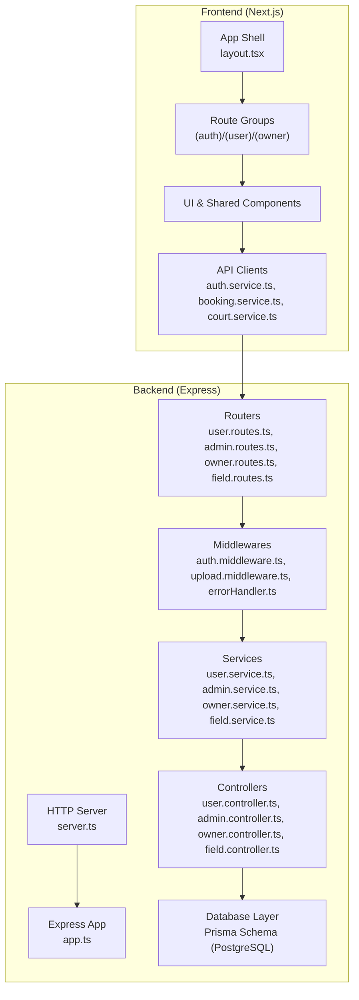
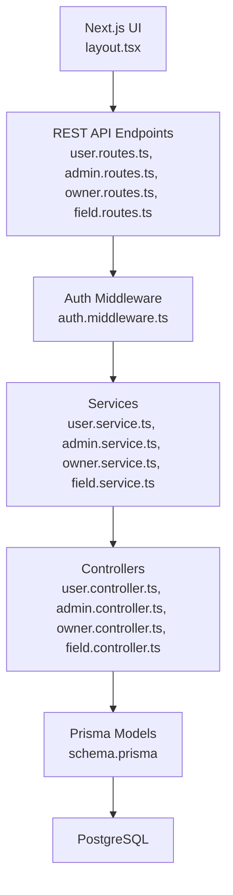
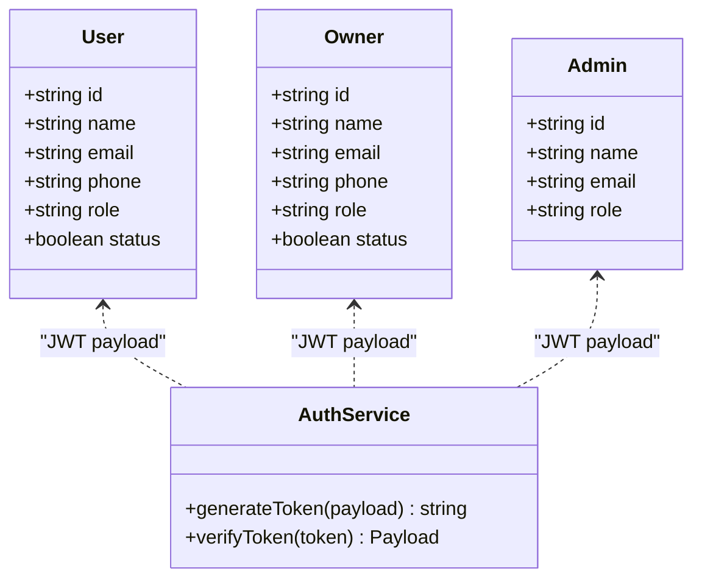
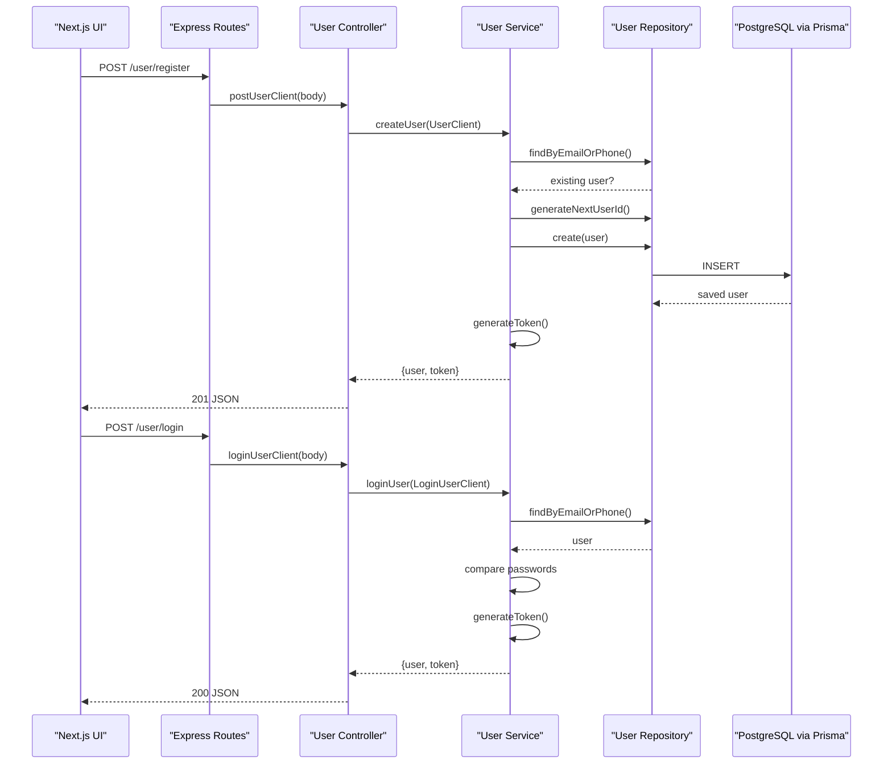
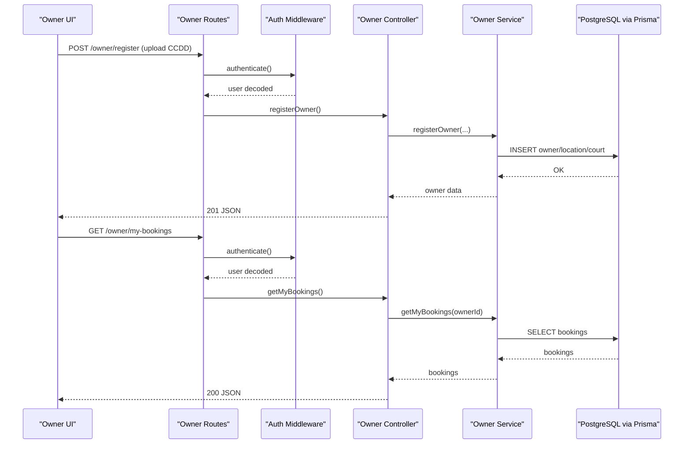
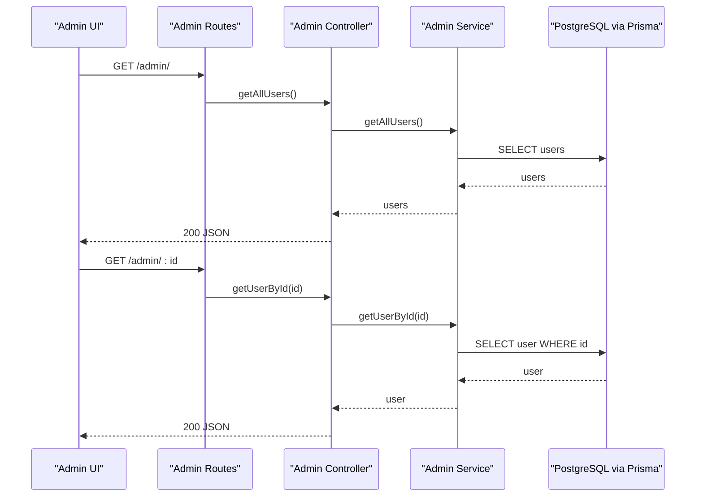
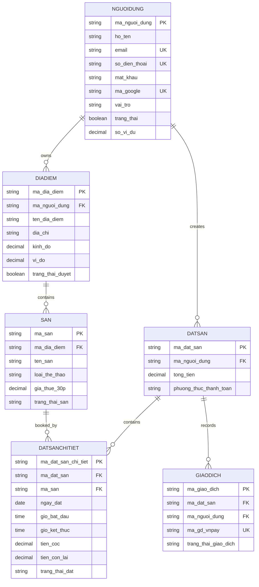
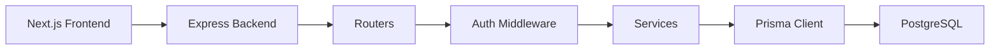

# Project Overview

<cite>
**Referenced Files in This Document**
- [package.json](file://backend/package.json)
- [package.json](file://frontend/package.json)
- [app.ts](file://backend/src/app.ts)
- [server.ts](file://backend/src/server.ts)
- [schema.prisma](file://backend/prisma/schema.prisma)
- [user.routes.ts](file://backend/src/routers/user.routes.ts)
- [admin.routes.ts](file://backend/src/routers/admin.routes.ts)
- [owner.routes.ts](file://backend/src/routers/owner.routes.ts)
- [field.routes.ts](file://backend/src/routers/field.routes.ts)
- [auth.middleware.ts](file://backend/src/middlewares/auth.middleware.ts)
- [jwt.ts](file://backend/src/utils/jwt.ts)
- [ApiError.ts](file://backend/src/utils/ApiError.ts)
- [user.controller.ts](file://backend/src/controllers/user.controller.ts)
- [admin.controller.ts](file://backend/src/controllers/admin.controller.ts)
- [user.service.ts](file://backend/src/services/user.service.ts)
- [user.type.ts](file://backend/src/types/user.type.ts)
- [booksport.type.ts](file://backend/src/types/booksport.type.ts)
- [layout.tsx](file://frontend/src/app/layout.tsx)
- [navigation.ts](file://frontend/src/constants/navigation.ts)
</cite>

## Table of Contents
1. [Introduction](#introduction)
2. [Project Structure](#project-structure)
3. [Core Components](#core-components)
4. [Architecture Overview](#architecture-overview)
5. [Detailed Component Analysis](#detailed-component-analysis)
6. [Dependency Analysis](#dependency-analysis)
7. [Performance Considerations](#performance-considerations)
8. [Troubleshooting Guide](#troubleshooting-guide)
9. [Conclusion](#conclusion)

## Introduction
Book Sport is a Vietnamese online sports venue booking platform designed to streamline reservations for football, badminton, tennis, and pickleball courts. Its core value proposition centers on convenience, transparency, and trust—enabling users to discover nearby facilities, compare pricing, and book courts quickly while providing owners with tools to manage inventory and bookings efficiently, and admins with oversight and governance capabilities. The platform targets sports enthusiasts, facility owners, and administrators operating within the Vietnamese sports ecosystem.

Key differentiators include:
- Multi-role architecture supporting Users, Owners, and Admins with role-specific dashboards and permissions.
- Full-stack Next.js frontend paired with an Express backend for a modern, responsive, and scalable web experience.
- Integrated payment and identity workflows with JWT-based authentication and secure storage integrations.
- Comprehensive data modeling for bookings, courts, locations, and transactions tailored to the Vietnamese market.

## Project Structure
The project follows a clear separation of concerns:
- Frontend: Next.js application under the frontend directory, implementing route-based UI, shared components, and service clients.
- Backend: Express server under the backend directory, organized by controllers, services, repositories, routers, and Prisma schema for data modeling.

**Diagram sources**
- [layout.tsx:1-50](file://frontend/src/app/layout.tsx#L1-L50)
- [app.ts:1-21](file://backend/src/app.ts#L1-L21)
- [server.ts:1-20](file://backend/src/server.ts#L1-L20)
- [user.routes.ts:1-10](file://backend/src/routers/user.routes.ts#L1-L10)
- [admin.routes.ts:1-6](file://backend/src/routers/admin.routes.ts#L1-L6)
- [owner.routes.ts:1-23](file://backend/src/routers/owner.routes.ts#L1-L23)
- [field.routes.ts:1-5](file://backend/src/routers/field.routes.ts#L1-L5)
- [auth.middleware.ts:1-28](file://backend/src/middlewares/auth.middleware.ts#L1-L28)
- [user.controller.ts:1-14](file://backend/src/controllers/user.controller.ts#L1-L14)
- [admin.controller.ts:1-13](file://backend/src/controllers/admin.controller.ts#L1-L13)
- [user.service.ts:1-69](file://backend/src/services/user.service.ts#L1-L69)
- [schema.prisma:1-126](file://backend/prisma/schema.prisma#L1-L126)

**Section sources**
- [package.json:1-41](file://backend/package.json#L1-L41)
- [package.json:1-39](file://frontend/package.json#L1-L39)
- [app.ts:1-21](file://backend/src/app.ts#L1-L21)
- [server.ts:1-20](file://backend/src/server.ts#L1-L20)
- [schema.prisma:1-126](file://backend/prisma/schema.prisma#L1-L126)

## Core Components
- Authentication and Authorization
  - JWT-based tokens are generated during registration and login and validated by the auth middleware for protected routes.
  - Role-aware token payload enables role-specific access control across owner/admin endpoints.

- User Management
  - Registration and login endpoints handle credential validation, password hashing, and token issuance.
  - Role defaults and status flags are persisted in the user model.

- Facility and Booking Management
  - Courts and locations are modeled with explicit fields for sport type, pricing, and operational status.
  - Booking requests and statuses are tracked per time slot with associated transaction records.

- Admin Oversight
  - Admin routes expose user listing and retrieval for monitoring and support.

- Frontend Navigation and UX
  - Route groups encapsulate user, owner, and admin experiences with dedicated dashboards and navigation constants.

**Section sources**
- [auth.middleware.ts:1-28](file://backend/src/middlewares/auth.middleware.ts#L1-L28)
- [jwt.ts:1-200](file://backend/src/utils/jwt.ts#L1-L200)
- [ApiError.ts:1-200](file://backend/src/utils/ApiError.ts#L1-L200)
- [user.controller.ts:1-14](file://backend/src/controllers/user.controller.ts#L1-L14)
- [admin.controller.ts:1-13](file://backend/src/controllers/admin.controller.ts#L1-L13)
- [user.service.ts:1-69](file://backend/src/services/user.service.ts#L1-L69)
- [user.type.ts:1-13](file://backend/src/types/user.type.ts#L1-L13)
- [booksport.type.ts:1-7](file://backend/src/types/booksport.type.ts#L1-L7)
- [navigation.ts:1-25](file://frontend/src/constants/navigation.ts#L1-L25)

## Architecture Overview
The system employs a clean layered architecture:
- Presentation Layer (Next.js): Handles UI rendering, routing, and user interactions.
- Application Layer (Express): Orchestrates business logic via controllers and services.
- Persistence Layer (Prisma + PostgreSQL): Manages relational data modeling and migrations.

**Diagram sources**
- [layout.tsx:1-50](file://frontend/src/app/layout.tsx#L1-L50)
- [user.routes.ts:1-10](file://backend/src/routers/user.routes.ts#L1-L10)
- [admin.routes.ts:1-6](file://backend/src/routers/admin.routes.ts#L1-L6)
- [owner.routes.ts:1-23](file://backend/src/routers/owner.routes.ts#L1-L23)
- [field.routes.ts:1-5](file://backend/src/routers/field.routes.ts#L1-L5)
- [auth.middleware.ts:1-28](file://backend/src/middlewares/auth.middleware.ts#L1-L28)
- [user.service.ts:1-69](file://backend/src/services/user.service.ts#L1-L69)
- [admin.controller.ts:1-13](file://backend/src/controllers/admin.controller.ts#L1-L13)
- [user.controller.ts:1-14](file://backend/src/controllers/user.controller.ts#L1-L14)
- [schema.prisma:1-126](file://backend/prisma/schema.prisma#L1-L126)

## Detailed Component Analysis

### Multi-Role Architecture
The platform supports three primary roles:
- Users: Register, log in, browse courts, and manage personal profiles and bookings.
- Owners: Register with identification uploads, manage their courts, view and update bookings, and monitor availability.
- Admins: Access user and facility oversight features for moderation and analytics.

**Diagram sources**
- [jwt.ts:1-200](file://backend/src/utils/jwt.ts#L1-L200)
- [user.service.ts:1-69](file://backend/src/services/user.service.ts#L1-L69)

**Section sources**
- [auth.middleware.ts:1-28](file://backend/src/middlewares/auth.middleware.ts#L1-L28)
- [jwt.ts:1-200](file://backend/src/utils/jwt.ts#L1-L200)
- [user.service.ts:1-69](file://backend/src/services/user.service.ts#L1-L69)

### User Registration and Login Workflow
This sequence illustrates the end-to-end flow for user onboarding and authentication.

**Diagram sources**
- [user.routes.ts:1-10](file://backend/src/routers/user.routes.ts#L1-L10)
- [user.controller.ts:1-14](file://backend/src/controllers/user.controller.ts#L1-L14)
- [user.service.ts:1-69](file://backend/src/services/user.service.ts#L1-L69)
- [user.type.ts:1-13](file://backend/src/types/user.type.ts#L1-L13)
- [schema.prisma:92-111](file://backend/prisma/schema.prisma#L92-L111)

**Section sources**
- [user.routes.ts:1-10](file://backend/src/routers/user.routes.ts#L1-L10)
- [user.controller.ts:1-14](file://backend/src/controllers/user.controller.ts#L1-L14)
- [user.service.ts:1-69](file://backend/src/services/user.service.ts#L1-L69)
- [user.type.ts:1-13](file://backend/src/types/user.type.ts#L1-L13)

### Owner Dashboard and Booking Management
Owners can register with identification uploads, manage their courts, and handle booking requests.

**Diagram sources**
- [owner.routes.ts:1-23](file://backend/src/routers/owner.routes.ts#L1-L23)
- [auth.middleware.ts:1-28](file://backend/src/middlewares/auth.middleware.ts#L1-L28)
- [schema.prisma:58-70](file://backend/prisma/schema.prisma#L58-L70)
- [schema.prisma:114-125](file://backend/prisma/schema.prisma#L114-L125)

**Section sources**
- [owner.routes.ts:1-23](file://backend/src/routers/owner.routes.ts#L1-L23)
- [auth.middleware.ts:1-28](file://backend/src/middlewares/auth.middleware.ts#L1-L28)

### Admin Oversight Workflow
Admins can list users and fetch individual profiles for support or auditing.

**Diagram sources**
- [admin.routes.ts:1-6](file://backend/src/routers/admin.routes.ts#L1-L6)
- [admin.controller.ts:1-13](file://backend/src/controllers/admin.controller.ts#L1-L13)
- [schema.prisma:92-111](file://backend/prisma/schema.prisma#L92-L111)

**Section sources**
- [admin.routes.ts:1-6](file://backend/src/routers/admin.routes.ts#L1-L6)
- [admin.controller.ts:1-13](file://backend/src/controllers/admin.controller.ts#L1-L13)

### Data Model Overview
The Prisma schema defines core entities for users, locations, courts, bookings, and transactions.

**Diagram sources**
- [schema.prisma:1-126](file://backend/prisma/schema.prisma#L1-L126)

**Section sources**
- [schema.prisma:1-126](file://backend/prisma/schema.prisma#L1-L126)

## Dependency Analysis
- Technology Stack
  - Frontend: Next.js 16.2.4, React 19.2.4, Tailwind CSS v4, Leaflet for maps, radix-ui for accessible UI primitives.
  - Backend: Express 5.x, TypeScript, Prisma ORM with PostgreSQL adapter, bcryptjs for password hashing, jsonwebtoken for JWT utilities, multer and Cloudinary for media uploads.
- Routing and Middleware
  - Route groups in Next.js align with backend endpoint namespaces (/user, /admin, /field, /owner) to maintain consistent domain boundaries.
  - Auth middleware enforces bearer token validation for owner/admin endpoints, ensuring role-aware access.

**Diagram sources**
- [package.json:1-39](file://frontend/package.json#L1-L39)
- [package.json:1-41](file://backend/package.json#L1-L41)
- [app.ts:1-21](file://backend/src/app.ts#L1-L21)
- [server.ts:1-20](file://backend/src/server.ts#L1-L20)
- [auth.middleware.ts:1-28](file://backend/src/middlewares/auth.middleware.ts#L1-L28)
- [schema.prisma:1-126](file://backend/prisma/schema.prisma#L1-L126)

**Section sources**
- [package.json:1-39](file://frontend/package.json#L1-L39)
- [package.json:1-41](file://backend/package.json#L1-L41)
- [app.ts:1-21](file://backend/src/app.ts#L1-L21)
- [server.ts:1-20](file://backend/src/server.ts#L1-L20)

## Performance Considerations
- Database Indexes and Constraints: Leverage Prisma-generated indexes and define composite indexes for frequently queried fields (e.g., booking date/time ranges, user identifiers) to optimize search and filtering.
- Caching Strategy: Implement caching for static court listings and location filters to reduce database load and improve response times.
- Pagination and Filtering: Apply pagination for booking lists and user/admin dashboards to limit payload sizes and enhance responsiveness.
- CDN and Media Delivery: Offload image assets to Cloudinary and serve via CDN to minimize latency for court photos and owner documents.
- Connection Pooling: Configure Prisma connection pooling appropriately for concurrent requests in production environments.

## Troubleshooting Guide
- Authentication Failures
  - Symptom: Requests to owner/admin endpoints receive unauthorized errors.
  - Cause: Missing or invalid Bearer token in Authorization header.
  - Resolution: Ensure clients attach a valid JWT token; verify token expiration and signature verification.

- User Registration Conflicts
  - Symptom: Registration fails with duplicate email or phone messages.
  - Cause: Existing user record with the same email or phone.
  - Resolution: Prompt users to use alternate credentials or recover accounts.

- Database Connectivity
  - Symptom: Server fails to start with database connection errors.
  - Cause: Incorrect database URL or Prisma client initialization failure.
  - Resolution: Verify environment variables and Prisma migration status; confirm PostgreSQL availability.

- Payment and Transaction Status
  - Symptom: Booking status does not reflect payment completion.
  - Cause: Discrepancy between booking and transaction records.
  - Resolution: Align transaction updates with payment provider callbacks and reconcile mismatches.

**Section sources**
- [auth.middleware.ts:1-28](file://backend/src/middlewares/auth.middleware.ts#L1-L28)
- [ApiError.ts:1-200](file://backend/src/utils/ApiError.ts#L1-L200)
- [server.ts:1-20](file://backend/src/server.ts#L1-L20)

## Conclusion
Book Sport delivers a robust, role-aware booking platform tailored to the Vietnamese sports market. Its full-stack architecture combines a modern Next.js frontend with a modular Express backend and a well-structured Prisma data model. By focusing on streamlined user onboarding, owner-friendly management tools, and admin oversight, the platform positions itself as a trusted solution for booking football, badminton, tennis, and pickleball venues across Vietnam.