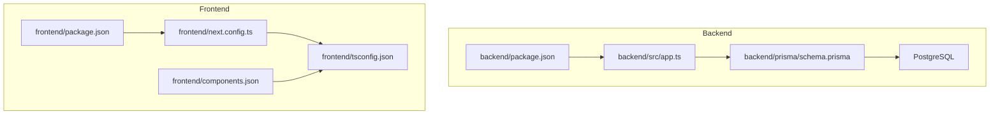
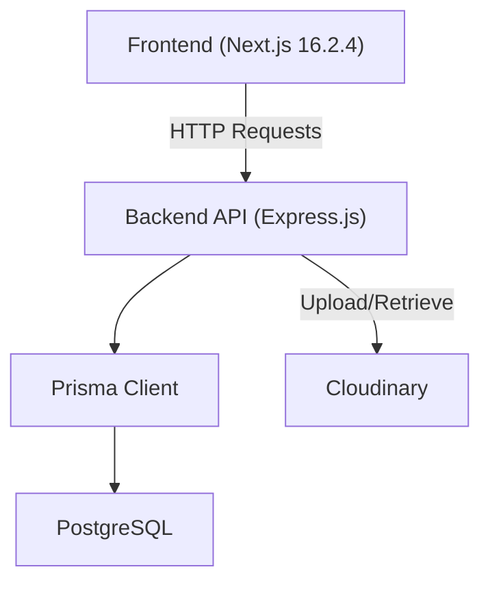
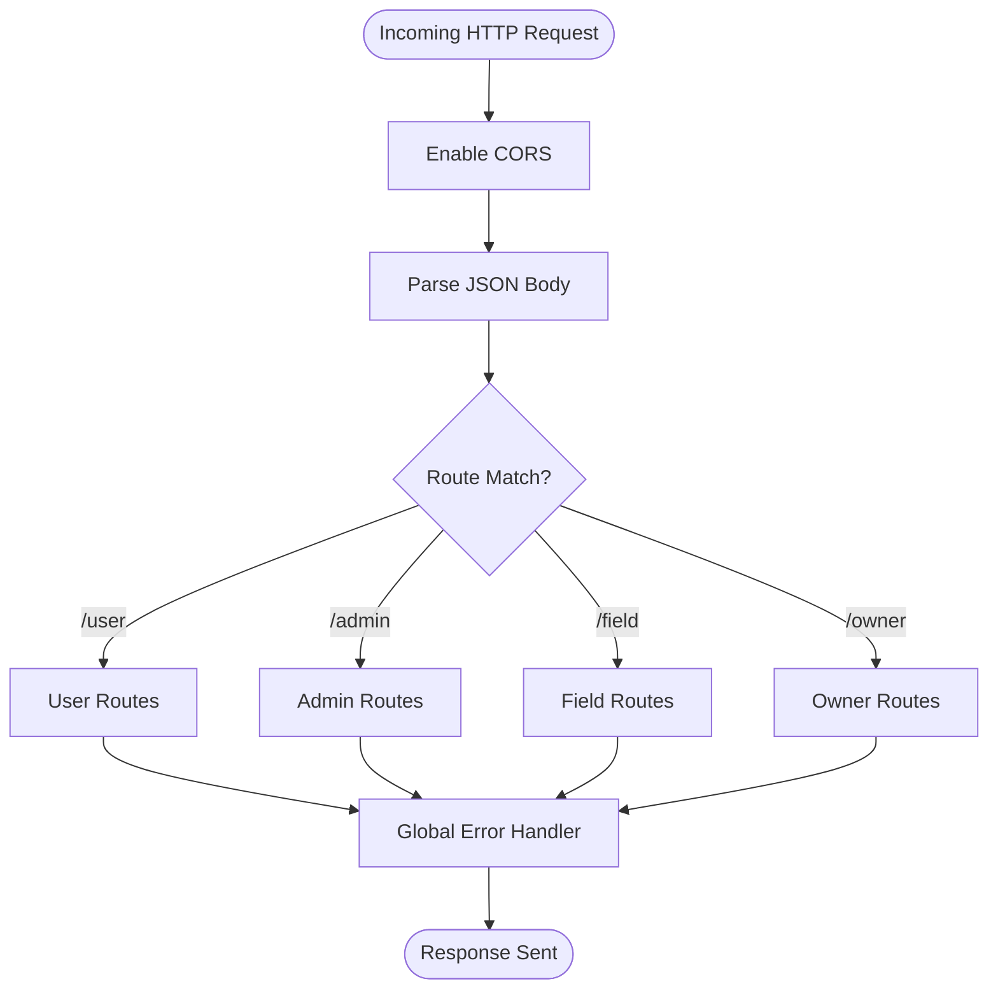
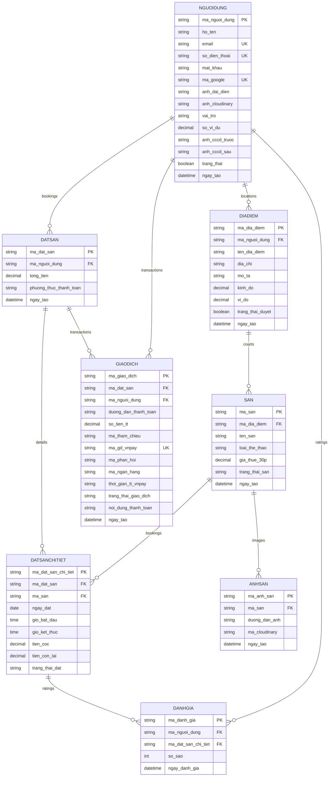
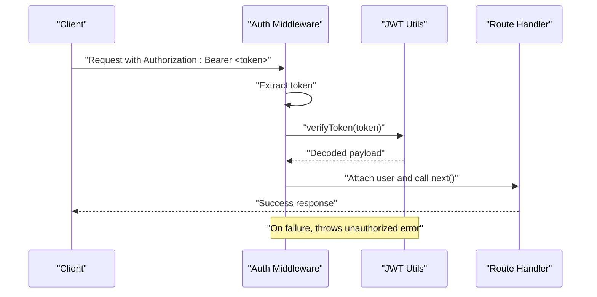
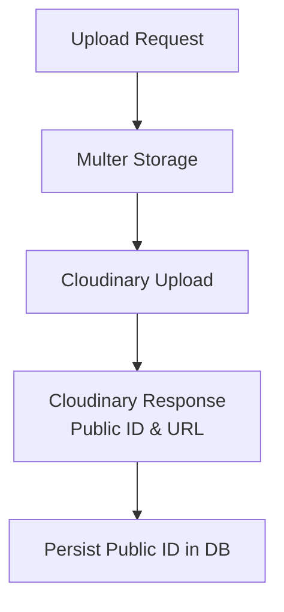
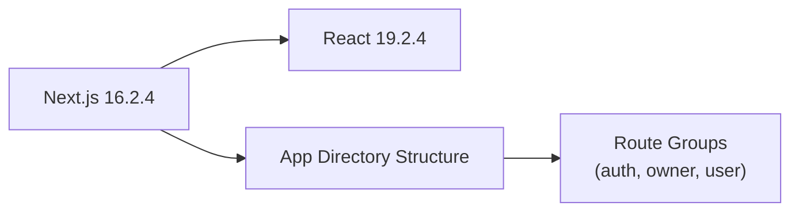
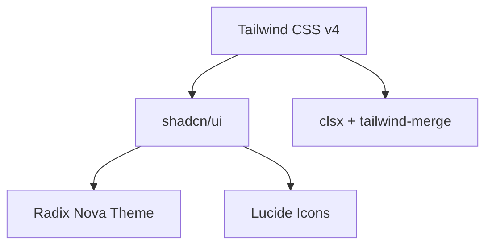
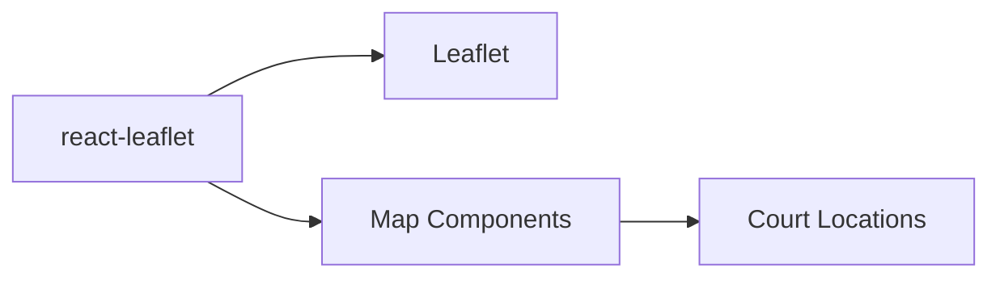
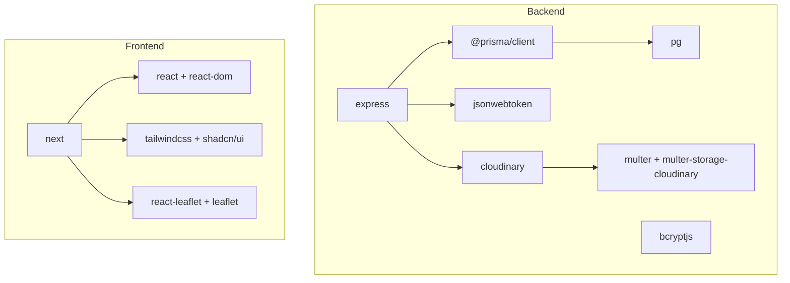

# Technology Stack & Dependencies

<cite>
**Referenced Files in This Document**
- [backend/package.json](file://backend/package.json)
- [frontend/package.json](file://frontend/package.json)
- [backend/prisma/schema.prisma](file://backend/prisma/schema.prisma)
- [backend/src/app.ts](file://backend/src/app.ts)
- [backend/src/config/cloudinary.config.ts](file://backend/src/config/cloudinary.config.ts)
- [backend/src/config/prisma.ts](file://backend/src/config/prisma.ts)
- [backend/src/middlewares/auth.middleware.ts](file://backend/src/middlewares/auth.middleware.ts)
- [backend/src/utils/jwt.ts](file://backend/src/utils/jwt.ts)
- [frontend/next.config.ts](file://frontend/next.config.ts)
- [frontend/components.json](file://frontend/components.json)
- [frontend/tsconfig.json](file://frontend/tsconfig.json)
- [backend/tsconfig.json](file://backend/tsconfig.json)
</cite>

## Table of Contents
1. [Introduction](#introduction)
2. [Project Structure](#project-structure)
3. [Core Components](#core-components)
4. [Architecture Overview](#architecture-overview)
5. [Detailed Component Analysis](#detailed-component-analysis)
6. [Dependency Analysis](#dependency-analysis)
7. [Performance Considerations](#performance-considerations)
8. [Troubleshooting Guide](#troubleshooting-guide)
9. [Conclusion](#conclusion)
10. [Appendices](#appendices)

## Introduction
This document provides a comprehensive overview of the technology stack and dependencies used in the sports facility booking platform. It covers backend technologies (Express.js, Prisma ORM, PostgreSQL, JWT authentication, and Cloudinary integration), frontend technologies (Next.js 16.2.4, React 19.2.4, Tailwind CSS, and React Leaflet), development tools, build configurations, and dependency management. It also explains the rationale behind technology choices, version compatibility, and upgrade considerations, along with links to official documentation and community resources.

## Project Structure
The project follows a monorepo-like structure with two primary directories:
- Backend: Node.js/TypeScript-based REST API built with Express.js, Prisma ORM, and PostgreSQL.
- Frontend: Next.js 16.2.4 application using React 19.2.4, Tailwind CSS, and React Leaflet for interactive maps.

**Diagram sources**
- [backend/src/app.ts:1-21](file://backend/src/app.ts#L1-L21)
- [backend/prisma/schema.prisma:1-126](file://backend/prisma/schema.prisma#L1-L126)
- [backend/package.json:1-41](file://backend/package.json#L1-L41)
- [frontend/package.json:1-39](file://frontend/package.json#L1-L39)
- [frontend/next.config.ts:1-9](file://frontend/next.config.ts#L1-L9)
- [frontend/components.json:1-26](file://frontend/components.json#L1-L26)
- [frontend/tsconfig.json:1-35](file://frontend/tsconfig.json#L1-L35)

**Section sources**
- [backend/src/app.ts:1-21](file://backend/src/app.ts#L1-L21)
- [frontend/next.config.ts:1-9](file://frontend/next.config.ts#L1-L9)

## Core Components
This section outlines the core technologies and their roles in the platform.

- Backend
  - Express.js: Web framework for building REST APIs and routing.
  - Prisma ORM: Database toolkit for schema definition, client generation, and database operations.
  - PostgreSQL: Relational database for persistent storage.
  - JWT Authentication: Stateless authentication using JSON Web Tokens.
  - Cloudinary: Media management and image/video delivery.

- Frontend
  - Next.js 16.2.4: Fullstack React framework with app router and static generation.
  - React 19.2.4: UI library for building user interfaces.
  - Tailwind CSS: Utility-first CSS framework for rapid UI development.
  - React Leaflet: React components for Leaflet maps to render interactive court locations.

- Development Tools and Build Configurations
  - TypeScript: Strongly typed JavaScript for improved developer experience.
  - ESLint: Code linting and style enforcement.
  - Tailwind v4 integration via PostCSS and shadcn configuration.
  - tsconfig.json for strict type checking and module resolution.

**Section sources**
- [backend/package.json:14-39](file://backend/package.json#L14-L39)
- [frontend/package.json:11-37](file://frontend/package.json#L11-L37)
- [backend/prisma/schema.prisma:1-126](file://backend/prisma/schema.prisma#L1-L126)
- [backend/src/app.ts:1-21](file://backend/src/app.ts#L1-L21)
- [backend/src/utils/jwt.ts:1-13](file://backend/src/utils/jwt.ts#L1-L13)
- [backend/src/config/cloudinary.config.ts:1-13](file://backend/src/config/cloudinary.config.ts#L1-L13)
- [frontend/next.config.ts:1-9](file://frontend/next.config.ts#L1-L9)
- [frontend/components.json:1-26](file://frontend/components.json#L1-L26)
- [frontend/tsconfig.json:1-35](file://frontend/tsconfig.json#L1-L35)
- [backend/tsconfig.json:1-45](file://backend/tsconfig.json#L1-L45)

## Architecture Overview
The system architecture separates concerns between the backend API and the frontend application. The backend exposes REST endpoints for user, admin, field, and owner domains, while the frontend consumes these endpoints to deliver a responsive booking experience. Prisma connects the backend to PostgreSQL, and Cloudinary handles media assets.

**Diagram sources**
- [backend/src/app.ts:1-21](file://backend/src/app.ts#L1-L21)
- [backend/src/config/prisma.ts:1-10](file://backend/src/config/prisma.ts#L1-L10)
- [backend/prisma/schema.prisma:1-126](file://backend/prisma/schema.prisma#L1-L126)
- [backend/src/config/cloudinary.config.ts:1-13](file://backend/src/config/cloudinary.config.ts#L1-L13)

## Detailed Component Analysis

### Backend Technologies

#### Express.js
- Role: Application server and routing for REST endpoints.
- Configuration: Centralized in the Express app with CORS enabled and JSON body parsing.
- Routing: Modular routes under user, admin, field, and owner namespaces.

**Diagram sources**
- [backend/src/app.ts:1-21](file://backend/src/app.ts#L1-L21)

**Section sources**
- [backend/src/app.ts:1-21](file://backend/src/app.ts#L1-L21)

#### Prisma ORM and PostgreSQL
- Schema Definition: Database schema defined declaratively with Prisma.
- Client Generation: Prisma client generated for type-safe database operations.
- Adapter: PrismaPg adapter used with the pg connection pool to connect to PostgreSQL.
- Data Models: Entities include users, courts, bookings, transactions, ratings, and locations.

**Diagram sources**
- [backend/prisma/schema.prisma:10-126](file://backend/prisma/schema.prisma#L10-L126)

**Section sources**
- [backend/prisma/schema.prisma:1-126](file://backend/prisma/schema.prisma#L1-L126)
- [backend/src/config/prisma.ts:1-10](file://backend/src/config/prisma.ts#L1-L10)

#### JWT Authentication
- Token Generation and Verification: Utilities sign and verify tokens with a secret and expiration.
- Middleware: Authentication middleware validates bearer tokens and attaches user info to requests.
- Error Handling: Unauthorized errors are thrown for missing or invalid tokens.

**Diagram sources**
- [backend/src/middlewares/auth.middleware.ts:1-28](file://backend/src/middlewares/auth.middleware.ts#L1-L28)
- [backend/src/utils/jwt.ts:1-13](file://backend/src/utils/jwt.ts#L1-L13)

**Section sources**
- [backend/src/middlewares/auth.middleware.ts:1-28](file://backend/src/middlewares/auth.middleware.ts#L1-L28)
- [backend/src/utils/jwt.ts:1-13](file://backend/src/utils/jwt.ts#L1-L13)

#### Cloudinary Integration
- Configuration: Cloudinary SDK configured using environment variables.
- Upload Middleware: Multer and Multer-Storage-Cloudinary are used for uploading media to Cloudinary.
- Usage: Images associated with courts and user profiles are stored and retrieved via Cloudinary.

**Diagram sources**
- [backend/src/config/cloudinary.config.ts:1-13](file://backend/src/config/cloudinary.config.ts#L1-L13)
- [backend/package.json:20-27](file://backend/package.json#L20-L27)

**Section sources**
- [backend/src/config/cloudinary.config.ts:1-13](file://backend/src/config/cloudinary.config.ts#L1-L13)
- [backend/package.json:20-27](file://backend/package.json#L20-L27)

### Frontend Technologies

#### Next.js 16.2.4 and React 19.2.4
- App Router: Uses the Next.js app directory with route groups for auth, owner, and user areas.
- Strict TypeScript: Enforced via tsconfig with strict mode and bundler module resolution.
- Compiler Optimizations: React compiler enabled in Next config.

**Diagram sources**
- [frontend/package.json:16-19](file://frontend/package.json#L16-L19)
- [frontend/next.config.ts:1-9](file://frontend/next.config.ts#L1-L9)
- [frontend/tsconfig.json:1-35](file://frontend/tsconfig.json#L1-L35)

**Section sources**
- [frontend/package.json:11-37](file://frontend/package.json#L11-L37)
- [frontend/next.config.ts:1-9](file://frontend/next.config.ts#L1-L9)
- [frontend/tsconfig.json:1-35](file://frontend/tsconfig.json#L1-L35)

#### Tailwind CSS and UI Libraries
- Tailwind v4: Integrated via PostCSS and configured through components.json.
- UI Components: shadcn/ui with radix-nova style and Lucide icons.
- Utility Functions: clsx and tailwind-merge for conditional class composition.

**Diagram sources**
- [frontend/components.json:1-26](file://frontend/components.json#L1-L26)
- [frontend/package.json:12-25](file://frontend/package.json#L12-L25)
- [frontend/src/lib/utils.ts:1-7](file://frontend/src/lib/utils.ts#L1-L7)

**Section sources**
- [frontend/components.json:1-26](file://frontend/components.json#L1-L26)
- [frontend/package.json:12-25](file://frontend/package.json#L12-L25)
- [frontend/src/lib/utils.ts:1-7](file://frontend/src/lib/utils.ts#L1-L7)

#### React Leaflet for Interactive Maps
- Integration: react-leaflet and leaflet enable map rendering and interactivity.
- Usage: Map components are used to display court locations and filters.

**Diagram sources**
- [frontend/package.json:21-21](file://frontend/package.json#L21-L21)

**Section sources**
- [frontend/package.json:21-21](file://frontend/package.json#L21-L21)

## Dependency Analysis
This section analyzes the relationships between backend and frontend dependencies and highlights key integrations.

**Diagram sources**
- [backend/package.json:14-27](file://backend/package.json#L14-L27)
- [frontend/package.json:11-25](file://frontend/package.json#L11-L25)

**Section sources**
- [backend/package.json:14-39](file://backend/package.json#L14-L39)
- [frontend/package.json:11-37](file://frontend/package.json#L11-L37)

## Performance Considerations
- Backend
  - Use Prisma’s generated client for efficient queries and reduce overhead.
  - Enable connection pooling via PrismaPg adapter to handle concurrent requests.
  - Minimize payload sizes by selecting only required fields in queries.
  - Cache frequently accessed data (e.g., court listings) to reduce database load.

- Frontend
  - Leverage Next.js static generation and caching for pages where appropriate.
  - Optimize images using Cloudinary transformations and lazy loading.
  - Split bundles and use dynamic imports for map-related components to reduce initial load.

[No sources needed since this section provides general guidance]

## Troubleshooting Guide
- Authentication Failures
  - Ensure Authorization header includes a valid Bearer token.
  - Verify JWT secret and expiration settings match backend configuration.

- Database Connectivity
  - Confirm DATABASE_URL environment variable is set and reachable.
  - Validate Prisma adapter configuration and connection pool settings.

- Cloudinary Upload Issues
  - Check Cloudinary credentials and bucket permissions.
  - Verify upload middleware configuration and file types.

- Tailwind CSS Not Applying
  - Ensure Tailwind is initialized with the correct CSS file and PostCSS pipeline.
  - Confirm shadcn/ui components are installed and configured.

**Section sources**
- [backend/src/middlewares/auth.middleware.ts:1-28](file://backend/src/middlewares/auth.middleware.ts#L1-L28)
- [backend/src/config/prisma.ts:1-10](file://backend/src/config/prisma.ts#L1-L10)
- [backend/src/config/cloudinary.config.ts:1-13](file://backend/src/config/cloudinary.config.ts#L1-L13)
- [frontend/components.json:1-26](file://frontend/components.json#L1-L26)

## Conclusion
The sports facility booking platform leverages a modern fullstack architecture with robust backend services powered by Express.js, Prisma ORM, and PostgreSQL, and a responsive frontend built with Next.js, React, Tailwind CSS, and React Leaflet. JWT authentication ensures secure access, while Cloudinary streamlines media management. The configuration files demonstrate strict TypeScript usage, modular routing, and scalable development practices. This foundation supports future enhancements, including advanced booking workflows, analytics, and payment integrations.

[No sources needed since this section summarizes without analyzing specific files]

## Appendices

### Version Compatibility and Upgrade Considerations
- Backend
  - Express.js: Align major versions with Node.js LTS support; review breaking changes in Express 5.x before upgrading.
  - Prisma: Keep @prisma/client and prisma in sync; use prisma migrate for schema changes.
  - PostgreSQL: Ensure pg adapter compatibility with database server version.
  - JWT: Maintain consistent secret management and token expiration policies during upgrades.

- Frontend
  - Next.js 16.2.4: Review release notes for app directory improvements and React 19 updates.
  - React 19.2.4: Validate compatibility with third-party libraries; test Suspense and compiler optimizations.
  - Tailwind CSS v4: Expect migration steps for new PostCSS pipeline; update shadcn/ui accordingly.
  - React Leaflet: Verify compatibility with leaflet 1.9.4+ and react-leaflet 5.x.

**Section sources**
- [backend/package.json:14-39](file://backend/package.json#L14-L39)
- [frontend/package.json:11-37](file://frontend/package.json#L11-L37)
- [frontend/next.config.ts:1-9](file://frontend/next.config.ts#L1-L9)

### Official Documentation and Community Resources
- Express.js: https://expressjs.com/
- Prisma: https://www.prisma.io/docs
- PostgreSQL: https://www.postgresql.org/docs/
- jsonwebtoken: https://github.com/auth0/node-jsonwebtoken
- Cloudinary: https://cloudinary.com/documentation
- Next.js: https://nextjs.org/docs
- React: https://react.dev/
- Tailwind CSS: https://tailwindcss.com/docs
- React Leaflet: https://react-leaflet.js.org/

[No sources needed since this section provides general guidance]