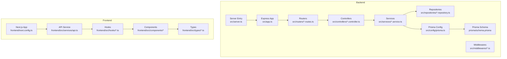
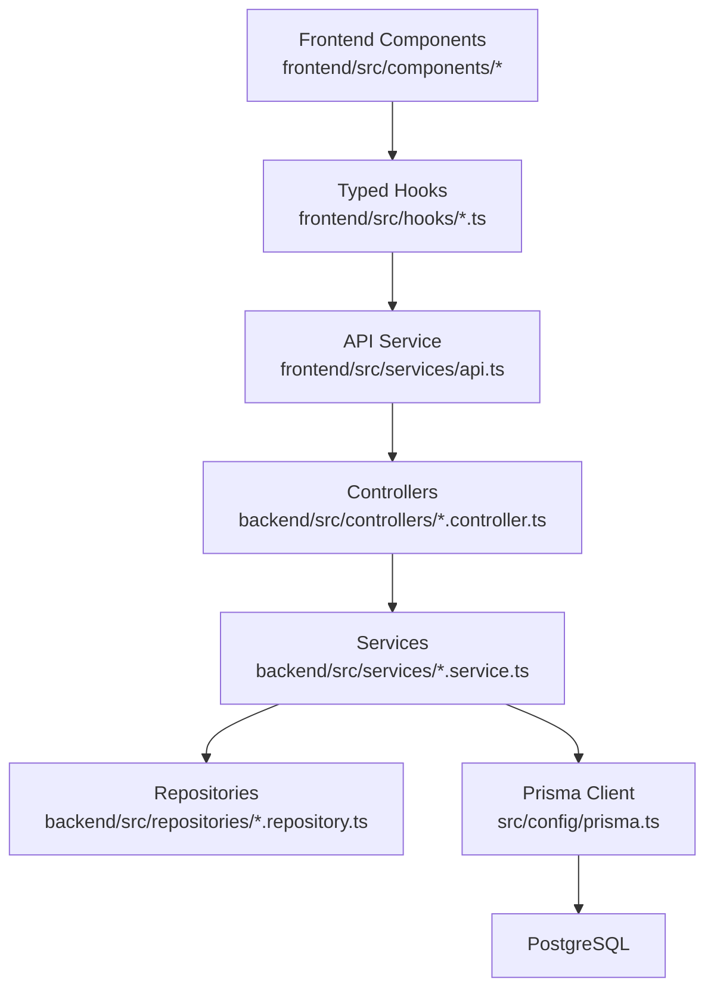
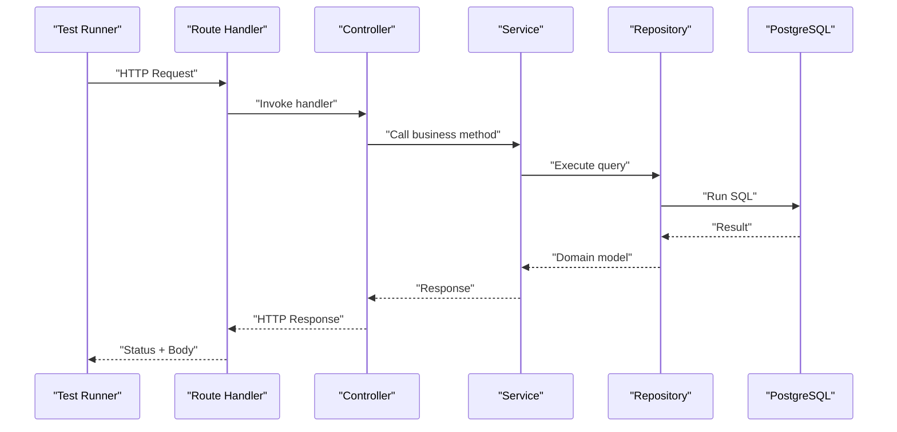
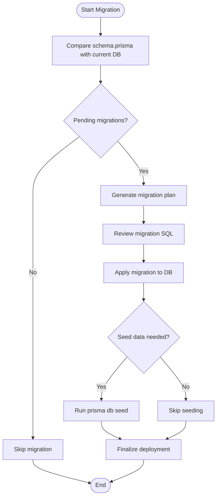
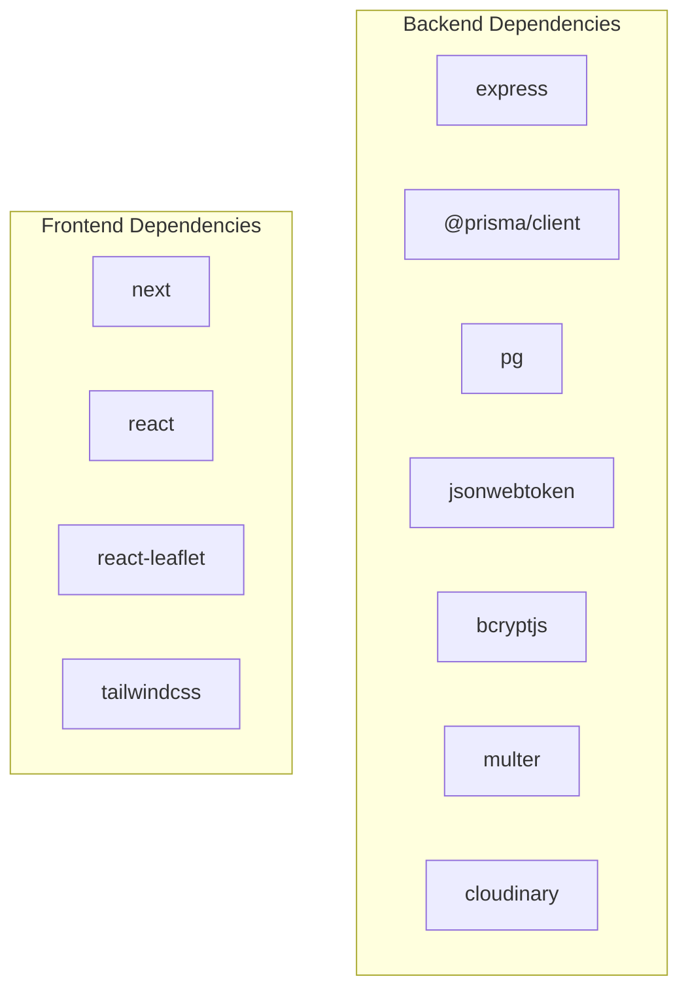

# Testing & Deployment

<cite>
**Referenced Files in This Document**
- [backend/package.json](file://backend/package.json)
- [backend/src/app.ts](file://backend/src/app.ts)
- [backend/src/server.ts](file://backend/src/server.ts)
- [backend/src/config/prisma.ts](file://backend/src/config/prisma.ts)
- [backend/prisma/schema.prisma](file://backend/prisma/schema.prisma)
- [backend/src/routers/user.routes.ts](file://backend/src/routers/user.routes.ts)
- [backend/src/routers/admin.routes.ts](file://backend/src/routers/admin.routes.ts)
- [backend/src/routers/field.routes.ts](file://backend/src/routers/field.routes.ts)
- [backend/src/routers/owner.routes.ts](file://backend/src/routers/owner.routes.ts)
- [backend/src/controllers/user.controller.ts](file://backend/src/controllers/user.controller.ts)
- [backend/src/controllers/admin.controller.ts](file://backend/src/controllers/admin.controller.ts)
- [backend/src/controllers/field.controller.ts](file://backend/src/controllers/field.controller.ts)
- [backend/src/controllers/owner.controller.ts](file://backend/src/controllers/owner.controller.ts)
- [backend/src/services/user.service.ts](file://backend/src/services/user.service.ts)
- [backend/src/services/admin.service.ts](file://backend/src/services/admin.service.ts)
- [backend/src/services/field.service.ts](file://backend/src/services/field.service.ts)
- [backend/src/services/owner.service.ts](file://backend/src/services/owner.service.ts)
- [backend/src/repositories/user.repository.ts](file://backend/src/repositories/user.repository.ts)
- [backend/src/repositories/booking.repository.ts](file://backend/src/repositories/booking.repository.ts)
- [backend/src/repositories/court.repository.ts](file://backend/src/repositories/court.repository.ts)
- [backend/src/repositories/location.repository.ts](file://backend/src/repositories/location.repository.ts)
- [backend/src/middlewares/auth.middleware.ts](file://backend/src/middlewares/auth.middleware.ts)
- [backend/src/middlewares/errorHandler.ts](file://backend/src/middlewares/errorHandler.ts)
- [backend/src/utils/jwt.ts](file://backend/src/utils/jwt.ts)
- [backend/src/utils/ApiError.ts](file://backend/src/utils/ApiError.ts)
- [frontend/package.json](file://frontend/package.json)
- [frontend/next.config.ts](file://frontend/next.config.ts)
- [frontend/src/services/api.ts](file://frontend/src/services/api.ts)
- [frontend/src/hooks/useFields.ts](file://frontend/src/hooks/useFields.ts)
- [frontend/src/hooks/useOwnerBookings.ts](file://frontend/src/hooks/useOwnerBookings.ts)
- [frontend/src/hooks/useOwnerCourts.ts](file://frontend/src/hooks/useOwnerCourts.ts)
- [frontend/src/components/map/MapClient.tsx](file://frontend/src/components/map/MapClient.tsx)
- [frontend/src/components/map/MapView.tsx](file://frontend/src/components/map/MapView.tsx)
- [frontend/src/components/map/MapWrapper.tsx](file://frontend/src/components/map/MapWrapper.tsx)
- [frontend/src/components/map/Sidebar.tsx](file://frontend/src/components/map/Sidebar.tsx)
- [frontend/src/components/home/CourtGrid.tsx](file://frontend/src/components/home/CourtGrid.tsx)
- [frontend/src/components/shared/CourtCard.tsx](file://frontend/src/components/shared/CourtCard.tsx)
- [frontend/src/components/layouts/Navbar.tsx](file://frontend/src/components/layouts/Navbar.tsx)
- [frontend/src/components/layouts/Footer.tsx](file://frontend/src/components/layouts/Footer.tsx)
- [frontend/src/constants/navigation.ts](file://frontend/src/constants/navigation.ts)
- [frontend/src/lib/utils.ts](file://frontend/src/lib/utils.ts)
- [frontend/src/types/api.types.ts](file://frontend/src/types/api.types.ts)
- [frontend/src/types/auth.types.ts](file://frontend/src/types/auth.types.ts)
- [frontend/src/types/booking.types.ts](file://frontend/src/types/booking.types.ts)
- [frontend/src/types/court.types.ts](file://frontend/src/types/court.types.ts)
</cite>

## Table of Contents
1. [Introduction](#introduction)
2. [Project Structure](#project-structure)
3. [Core Components](#core-components)
4. [Architecture Overview](#architecture-overview)
5. [Detailed Component Analysis](#detailed-component-analysis)
6. [Dependency Analysis](#dependency-analysis)
7. [Performance Considerations](#performance-considerations)
8. [Troubleshooting Guide](#troubleshooting-guide)
9. [Conclusion](#conclusion)
10. [Appendices](#appendices)

## Introduction
This document provides comprehensive testing and deployment guidance for the sports facility booking platform. It covers backend unit and integration testing strategies, API endpoint testing approaches, frontend testing with React Testing Library, performance testing methodologies, accessibility testing requirements, and deployment procedures for development and production environments. It also details environment variable management, database migration strategies using Prisma, monitoring setup, CI/CD pipeline configuration, automated testing integration, and rollback procedures.

## Project Structure
The platform consists of:
- Backend: Express-based server with TypeScript, Prisma ORM, and modular routing for user, admin, field, and owner domains.
- Frontend: Next.js application with React components, services, hooks, and type definitions for API communication and UI logic.

**Diagram sources**
- [backend/src/app.ts:1-21](file://backend/src/app.ts#L1-L21)
- [backend/src/server.ts:1-20](file://backend/src/server.ts#L1-L20)
- [backend/src/config/prisma.ts](file://backend/src/config/prisma.ts)
- [backend/prisma/schema.prisma:1-126](file://backend/prisma/schema.prisma#L1-L126)
- [backend/src/routers/user.routes.ts](file://backend/src/routers/user.routes.ts)
- [backend/src/routers/admin.routes.ts](file://backend/src/routers/admin.routes.ts)
- [backend/src/routers/field.routes.ts](file://backend/src/routers/field.routes.ts)
- [backend/src/routers/owner.routes.ts](file://backend/src/routers/owner.routes.ts)
- [backend/src/controllers/user.controller.ts](file://backend/src/controllers/user.controller.ts)
- [backend/src/controllers/admin.controller.ts](file://backend/src/controllers/admin.controller.ts)
- [backend/src/controllers/field.controller.ts](file://backend/src/controllers/field.controller.ts)
- [backend/src/controllers/owner.controller.ts](file://backend/src/controllers/owner.controller.ts)
- [backend/src/services/user.service.ts](file://backend/src/services/user.service.ts)
- [backend/src/services/admin.service.ts](file://backend/src/services/admin.service.ts)
- [backend/src/services/field.service.ts](file://backend/src/services/field.service.ts)
- [backend/src/services/owner.service.ts](file://backend/src/services/owner.service.ts)
- [backend/src/repositories/user.repository.ts](file://backend/src/repositories/user.repository.ts)
- [backend/src/repositories/booking.repository.ts](file://backend/src/repositories/booking.repository.ts)
- [backend/src/repositories/court.repository.ts](file://backend/src/repositories/court.repository.ts)
- [backend/src/repositories/location.repository.ts](file://backend/src/repositories/location.repository.ts)
- [backend/src/middlewares/auth.middleware.ts](file://backend/src/middlewares/auth.middleware.ts)
- [backend/src/middlewares/errorHandler.ts](file://backend/src/middlewares/errorHandler.ts)
- [frontend/next.config.ts](file://frontend/next.config.ts)
- [frontend/src/services/api.ts](file://frontend/src/services/api.ts)
- [frontend/src/hooks/useFields.ts](file://frontend/src/hooks/useFields.ts)
- [frontend/src/hooks/useOwnerBookings.ts](file://frontend/src/hooks/useOwnerBookings.ts)
- [frontend/src/hooks/useOwnerCourts.ts](file://frontend/src/hooks/useOwnerCourts.ts)
- [frontend/src/components/map/MapClient.tsx](file://frontend/src/components/map/MapClient.tsx)
- [frontend/src/components/map/MapView.tsx](file://frontend/src/components/map/MapView.tsx)
- [frontend/src/components/map/MapWrapper.tsx](file://frontend/src/components/map/MapWrapper.tsx)
- [frontend/src/components/map/Sidebar.tsx](file://frontend/src/components/map/Sidebar.tsx)
- [frontend/src/components/home/CourtGrid.tsx](file://frontend/src/components/home/CourtGrid.tsx)
- [frontend/src/components/shared/CourtCard.tsx](file://frontend/src/components/shared/CourtCard.tsx)
- [frontend/src/components/layouts/Navbar.tsx](file://frontend/src/components/layouts/Navbar.tsx)
- [frontend/src/components/layouts/Footer.tsx](file://frontend/src/components/layouts/Footer.tsx)
- [frontend/src/constants/navigation.ts](file://frontend/src/constants/navigation.ts)
- [frontend/src/lib/utils.ts](file://frontend/src/lib/utils.ts)
- [frontend/src/types/api.types.ts](file://frontend/src/types/api.types.ts)
- [frontend/src/types/auth.types.ts](file://frontend/src/types/auth.types.ts)
- [frontend/src/types/booking.types.ts](file://frontend/src/types/booking.types.ts)
- [frontend/src/types/court.types.ts](file://frontend/src/types/court.types.ts)

**Section sources**
- [backend/src/app.ts:1-21](file://backend/src/app.ts#L1-L21)
- [backend/src/server.ts:1-20](file://backend/src/server.ts#L1-L20)
- [frontend/next.config.ts](file://frontend/next.config.ts)

## Core Components
- Backend entrypoint initializes Express, loads environment variables, enables CORS, parses JSON, mounts routers, and registers error handling middleware.
- Prisma ORM connects to PostgreSQL and generates client code for type-safe database operations.
- Modular routers expose domain-specific endpoints under /user, /admin, /field, and /owner.
- Controllers handle HTTP requests, delegate to services, and return structured responses.
- Services encapsulate business logic and orchestrate repository interactions.
- Repositories abstract database queries and mutations.
- Middlewares implement authentication and centralized error handling.
- Frontend Next.js app integrates with API service, consumes typed hooks, and renders UI components.

**Section sources**
- [backend/src/app.ts:1-21](file://backend/src/app.ts#L1-L21)
- [backend/src/server.ts:1-20](file://backend/src/server.ts#L1-L20)
- [backend/src/config/prisma.ts](file://backend/src/config/prisma.ts)
- [backend/prisma/schema.prisma:1-126](file://backend/prisma/schema.prisma#L1-L126)
- [backend/src/routers/user.routes.ts](file://backend/src/routers/user.routes.ts)
- [backend/src/routers/admin.routes.ts](file://backend/src/routers/admin.routes.ts)
- [backend/src/routers/field.routes.ts](file://backend/src/routers/field.routes.ts)
- [backend/src/routers/owner.routes.ts](file://backend/src/routers/owner.routes.ts)
- [backend/src/controllers/user.controller.ts](file://backend/src/controllers/user.controller.ts)
- [backend/src/controllers/admin.controller.ts](file://backend/src/controllers/admin.controller.ts)
- [backend/src/controllers/field.controller.ts](file://backend/src/controllers/field.controller.ts)
- [backend/src/controllers/owner.controller.ts](file://backend/src/controllers/owner.controller.ts)
- [backend/src/services/user.service.ts](file://backend/src/services/user.service.ts)
- [backend/src/services/admin.service.ts](file://backend/src/services/admin.service.ts)
- [backend/src/services/field.service.ts](file://backend/src/services/field.service.ts)
- [backend/src/services/owner.service.ts](file://backend/src/services/owner.service.ts)
- [backend/src/repositories/user.repository.ts](file://backend/src/repositories/user.repository.ts)
- [backend/src/repositories/booking.repository.ts](file://backend/src/repositories/booking.repository.ts)
- [backend/src/repositories/court.repository.ts](file://backend/src/repositories/court.repository.ts)
- [backend/src/repositories/location.repository.ts](file://backend/src/repositories/location.repository.ts)
- [backend/src/middlewares/auth.middleware.ts](file://backend/src/middlewares/auth.middleware.ts)
- [backend/src/middlewares/errorHandler.ts](file://backend/src/middlewares/errorHandler.ts)
- [frontend/src/services/api.ts](file://frontend/src/services/api.ts)
- [frontend/src/hooks/useFields.ts](file://frontend/src/hooks/useFields.ts)
- [frontend/src/hooks/useOwnerBookings.ts](file://frontend/src/hooks/useOwnerBookings.ts)
- [frontend/src/hooks/useOwnerCourts.ts](file://frontend/src/hooks/useOwnerCourts.ts)

## Architecture Overview
The system follows a layered architecture:
- Presentation Layer: Next.js frontend components and pages.
- Application Layer: API service and typed hooks.
- Domain Layer: Controllers and services per domain (user, admin, field, owner).
- Persistence Layer: Prisma ORM with PostgreSQL.

**Diagram sources**
- [frontend/src/components/map/MapClient.tsx](file://frontend/src/components/map/MapClient.tsx)
- [frontend/src/components/map/MapView.tsx](file://frontend/src/components/map/MapView.tsx)
- [frontend/src/components/map/MapWrapper.tsx](file://frontend/src/components/map/MapWrapper.tsx)
- [frontend/src/components/map/Sidebar.tsx](file://frontend/src/components/map/Sidebar.tsx)
- [frontend/src/components/home/CourtGrid.tsx](file://frontend/src/components/home/CourtGrid.tsx)
- [frontend/src/components/shared/CourtCard.tsx](file://frontend/src/components/shared/CourtCard.tsx)
- [frontend/src/services/api.ts](file://frontend/src/services/api.ts)
- [frontend/src/hooks/useFields.ts](file://frontend/src/hooks/useFields.ts)
- [frontend/src/hooks/useOwnerBookings.ts](file://frontend/src/hooks/useOwnerBookings.ts)
- [frontend/src/hooks/useOwnerCourts.ts](file://frontend/src/hooks/useOwnerCourts.ts)
- [backend/src/controllers/user.controller.ts](file://backend/src/controllers/user.controller.ts)
- [backend/src/controllers/admin.controller.ts](file://backend/src/controllers/admin.controller.ts)
- [backend/src/controllers/field.controller.ts](file://backend/src/controllers/field.controller.ts)
- [backend/src/controllers/owner.controller.ts](file://backend/src/controllers/owner.controller.ts)
- [backend/src/services/user.service.ts](file://backend/src/services/user.service.ts)
- [backend/src/services/admin.service.ts](file://backend/src/services/admin.service.ts)
- [backend/src/services/field.service.ts](file://backend/src/services/field.service.ts)
- [backend/src/services/owner.service.ts](file://backend/src/services/owner.service.ts)
- [backend/src/repositories/user.repository.ts](file://backend/src/repositories/user.repository.ts)
- [backend/src/repositories/booking.repository.ts](file://backend/src/repositories/booking.repository.ts)
- [backend/src/repositories/court.repository.ts](file://backend/src/repositories/court.repository.ts)
- [backend/src/repositories/location.repository.ts](file://backend/src/repositories/location.repository.ts)
- [backend/src/config/prisma.ts](file://backend/src/config/prisma.ts)

## Detailed Component Analysis

### Backend Unit Testing Strategy
- Test controllers in isolation by mocking services and repositories.
- Verify service methods with mocked repository dependencies to assert business logic correctness.
- Use in-memory database or test-specific Prisma client configuration for repository tests.
- Validate middleware behavior (authentication, error handling) via controller tests.
- Employ assertion libraries to confirm response status codes, headers, and payload shapes.

Recommended coverage:
- Controllers: 100% branch and path coverage for route handlers.
- Services: 90%+ branch coverage for business logic.
- Repositories: 80%+ statement coverage for CRUD operations.
- Middlewares: 100% branch coverage for error and auth flows.

**Section sources**
- [backend/src/controllers/user.controller.ts](file://backend/src/controllers/user.controller.ts)
- [backend/src/controllers/admin.controller.ts](file://backend/src/controllers/admin.controller.ts)
- [backend/src/controllers/field.controller.ts](file://backend/src/controllers/field.controller.ts)
- [backend/src/controllers/owner.controller.ts](file://backend/src/controllers/owner.controller.ts)
- [backend/src/services/user.service.ts](file://backend/src/services/user.service.ts)
- [backend/src/services/admin.service.ts](file://backend/src/services/admin.service.ts)
- [backend/src/services/field.service.ts](file://backend/src/services/field.service.ts)
- [backend/src/services/owner.service.ts](file://backend/src/services/owner.service.ts)
- [backend/src/repositories/user.repository.ts](file://backend/src/repositories/user.repository.ts)
- [backend/src/repositories/booking.repository.ts](file://backend/src/repositories/booking.repository.ts)
- [backend/src/repositories/court.repository.ts](file://backend/src/repositories/court.repository.ts)
- [backend/src/repositories/location.repository.ts](file://backend/src/repositories/location.repository.ts)
- [backend/src/middlewares/auth.middleware.ts](file://backend/src/middlewares/auth.middleware.ts)
- [backend/src/middlewares/errorHandler.ts](file://backend/src/middlewares/errorHandler.ts)

### Backend Integration Testing Procedures
- Spin up a test database container or use a dedicated test Postgres instance.
- Run Prisma migrations for the test environment to align schema.
- Initialize the Express app with test configuration and mount routers.
- Use supertest or similar HTTP assertion libraries to send requests to mounted routes.
- Validate end-to-end flows: authentication, booking creation, payment processing, and status updates.
- Clean up test data after each suite using transactions or truncate operations.

Key endpoints to test:
- Authentication: POST /user/login, POST /user/register
- Booking: GET /field/courts, POST /user/bookings, GET /owner/bookings
- Admin: GET /admin/dashboard, PATCH /admin/status
- Owner: POST /owner/courts, GET /owner/courts, PUT /owner/courts/:id

**Section sources**
- [backend/src/app.ts:1-21](file://backend/src/app.ts#L1-L21)
- [backend/src/server.ts:1-20](file://backend/src/server.ts#L1-L20)
- [backend/prisma/schema.prisma:1-126](file://backend/prisma/schema.prisma#L1-L126)
- [backend/src/routers/user.routes.ts](file://backend/src/routers/user.routes.ts)
- [backend/src/routers/admin.routes.ts](file://backend/src/routers/admin.routes.ts)
- [backend/src/routers/field.routes.ts](file://backend/src/routers/field.routes.ts)
- [backend/src/routers/owner.routes.ts](file://backend/src/routers/owner.routes.ts)

### API Endpoint Testing Approaches
- Define OpenAPI/Swagger-like contracts for each endpoint (request/response schemas).
- Use automated tools to validate request/response against contracts.
- Implement property-based testing for varied inputs and edge cases.
- Test error scenarios: invalid JWT, missing fields, unauthorized access, and rate limits.
- Mock external integrations (payment providers) behind fakes or stubs.

**Diagram sources**
- [backend/src/routers/user.routes.ts](file://backend/src/routers/user.routes.ts)
- [backend/src/controllers/user.controller.ts](file://backend/src/controllers/user.controller.ts)
- [backend/src/services/user.service.ts](file://backend/src/services/user.service.ts)
- [backend/src/repositories/user.repository.ts](file://backend/src/repositories/user.repository.ts)
- [backend/src/config/prisma.ts](file://backend/src/config/prisma.ts)

### Frontend Testing with React Testing Library
- Component testing: Render components in isolation, simulate user interactions, assert DOM updates, and verify prop-driven behavior.
- Hook testing: Use renderHook to test custom hooks, mock API service, and assert state transitions.
- Integration testing: Compose components and hooks to validate end-to-end flows (e.g., map view rendering, booking form submission).
- Accessibility testing: Use axe-core or similar tools to scan components for WCAG compliance during CI.
- Snapshot testing: Maintain snapshots for static components; update only when intentional UI changes occur.

Recommended coverage:
- Components: 90%+ of interactive elements covered by tests.
- Hooks: 100% branch coverage for logic paths.
- Pages: End-to-end user journeys tested via component composition.

**Section sources**
- [frontend/src/components/map/MapClient.tsx](file://frontend/src/components/map/MapClient.tsx)
- [frontend/src/components/map/MapView.tsx](file://frontend/src/components/map/MapView.tsx)
- [frontend/src/components/map/MapWrapper.tsx](file://frontend/src/components/map/MapWrapper.tsx)
- [frontend/src/components/map/Sidebar.tsx](file://frontend/src/components/map/Sidebar.tsx)
- [frontend/src/components/home/CourtGrid.tsx](file://frontend/src/components/home/CourtGrid.tsx)
- [frontend/src/components/shared/CourtCard.tsx](file://frontend/src/components/shared/CourtCard.tsx)
- [frontend/src/hooks/useFields.ts](file://frontend/src/hooks/useFields.ts)
- [frontend/src/hooks/useOwnerBookings.ts](file://frontend/src/hooks/useOwnerBookings.ts)
- [frontend/src/hooks/useOwnerCourts.ts](file://frontend/src/hooks/useOwnerCourts.ts)
- [frontend/src/services/api.ts](file://frontend/src/services/api.ts)

### Performance Testing Methodologies
- Load testing: Use tools like k6 or Artillery to simulate concurrent users performing booking flows.
- Database query profiling: Monitor slow queries and optimize indexes; use EXPLAIN/ANALYZE on PostgreSQL.
- Frontend performance: Measure LCP, FID, CLS; optimize bundle sizes and lazy-load heavy components.
- API latency: Benchmark endpoints under load; set SLOs for response times and error rates.
- Caching: Implement Redis/Memcached for frequently accessed data; monitor hit ratios.

[No sources needed since this section provides general guidance]

### Accessibility Testing Requirements
- Automated scanning: Integrate axe-core tests in CI to flag WCAG violations.
- Manual testing: Validate keyboard navigation, screen reader compatibility, and color contrast.
- ARIA attributes: Ensure proper roles, labels, and live regions for dynamic content.
- Semantic HTML: Prefer native elements for interactive controls.

[No sources needed since this section provides general guidance]

### Environment Variable Management
- Backend variables: DATABASE_URL, JWT_SECRET, PORT, NODE_ENV, CLOUDINARY_*.
- Frontend variables: NEXT_PUBLIC_API_BASE_URL, NEXT_PUBLIC_APP_ENV.
- Keep sensitive keys out of version control; use encrypted secrets storage in CI/CD.
- Maintain separate .env files for local development and CI environments.

**Section sources**
- [backend/src/server.ts:1-20](file://backend/src/server.ts#L1-L20)
- [backend/src/app.ts:1-21](file://backend/src/app.ts#L1-L21)
- [frontend/next.config.ts](file://frontend/next.config.ts)

### Database Migration Strategies with Prisma
- Development: Use prisma dev to scaffold migrations locally; keep schema.prisma as the single source of truth.
- Staging: Apply migrations using prisma migrate deploy in CI before starting the server.
- Production: Use prisma migrate deploy with dry-run checks; maintain rollback plans.
- Seed data: Use prisma db seed for initial fixtures; version control seed scripts.

**Diagram sources**
- [backend/prisma/schema.prisma:1-126](file://backend/prisma/schema.prisma#L1-L126)
- [backend/src/config/prisma.ts](file://backend/src/config/prisma.ts)

**Section sources**
- [backend/prisma/schema.prisma:1-126](file://backend/prisma/schema.prisma#L1-L126)
- [backend/src/config/prisma.ts](file://backend/src/config/prisma.ts)

### Monitoring Setup
- Backend: Instrument metrics (request duration, error rates) and logs; integrate with APM tools.
- Frontend: Track client-side errors, navigation metrics, and Core Web Vitals.
- Observability: Centralize logs and traces; configure alerts for critical thresholds.

[No sources needed since this section provides general guidance]

### CI/CD Pipeline Configuration
- Build: Install dependencies for backend and frontend, compile TypeScript, and build Next.js.
- Test: Run unit and integration tests; enforce coverage thresholds.
- Security: Scan dependencies and secrets; block high-risk vulnerabilities.
- Deploy: Deploy backend to a containerized environment; deploy frontend to static hosting.
- Rollback: Maintain immutable artifacts; support quick rollback to previous versions.

[No sources needed since this section provides general guidance]

### Automated Testing Integration
- Backend: Add test scripts and configure Jest/Vitest; run tests in CI with coverage reporting.
- Frontend: Configure React Testing Library; run tests in CI with accessibility checks.

**Section sources**
- [backend/package.json:6-8](file://backend/package.json#L6-L8)
- [frontend/package.json:5-10](file://frontend/package.json#L5-L10)

### Rollback Procedures
- Backend: Re-deploy previous Docker image tag; revert Prisma migrations if necessary.
- Frontend: Serve previous static build; invalidate CDN cache.
- Database: Restore from last known good backup; re-apply safe migrations only.

[No sources needed since this section provides general guidance]

## Dependency Analysis
Backend dependencies include Express, Prisma, bcrypt, JWT, Multer, Cloudinary, and PostgreSQL driver. Frontend depends on Next.js, React, Tailwind, and Leaflet for mapping.

**Diagram sources**
- [backend/package.json:14-27](file://backend/package.json#L14-L27)
- [frontend/package.json:11-25](file://frontend/package.json#L11-L25)

**Section sources**
- [backend/package.json:1-41](file://backend/package.json#L1-L41)
- [frontend/package.json:1-39](file://frontend/package.json#L1-L39)

## Performance Considerations
- Optimize database queries with appropriate indexes and connection pooling.
- Minimize frontend bundle size; leverage code splitting and lazy loading.
- Cache frequently accessed data; implement efficient pagination for listings.
- Monitor and tune API response sizes; compress payloads where feasible.

[No sources needed since this section provides general guidance]

## Troubleshooting Guide
- Server startup failures: Verify DATABASE_URL connectivity and Prisma client initialization.
- CORS errors: Confirm CORS configuration and origin allowances.
- Authentication issues: Validate JWT secret and token expiration.
- Middleware errors: Inspect error handler middleware for uncaught exceptions.

**Section sources**
- [backend/src/server.ts:1-20](file://backend/src/server.ts#L1-L20)
- [backend/src/app.ts:1-21](file://backend/src/app.ts#L1-L21)
- [backend/src/middlewares/errorHandler.ts](file://backend/src/middlewares/errorHandler.ts)
- [backend/src/middlewares/auth.middleware.ts](file://backend/src/middlewares/auth.middleware.ts)
- [backend/src/utils/jwt.ts](file://backend/src/utils/jwt.ts)
- [backend/src/utils/ApiError.ts](file://backend/src/utils/ApiError.ts)

## Conclusion
This guide outlines a robust testing and deployment strategy for the sports facility booking platform. By combining backend unit/integration tests, frontend React Testing Library coverage, performance and accessibility testing, and disciplined deployment practices with Prisma migrations, the platform can achieve reliability, scalability, and maintainability across development and production environments.

## Appendices
- API Types and Contracts: Use typed request/response interfaces to enforce API contracts.
- Navigation Constants: Maintain centralized navigation definitions for consistent routing.
- Utility Functions: Shared helpers for formatting and validation improve code reuse.

**Section sources**
- [frontend/src/types/api.types.ts](file://frontend/src/types/api.types.ts)
- [frontend/src/types/auth.types.ts](file://frontend/src/types/auth.types.ts)
- [frontend/src/types/booking.types.ts](file://frontend/src/types/booking.types.ts)
- [frontend/src/types/court.types.ts](file://frontend/src/types/court.types.ts)
- [frontend/src/constants/navigation.ts](file://frontend/src/constants/navigation.ts)
- [frontend/src/lib/utils.ts](file://frontend/src/lib/utils.ts)